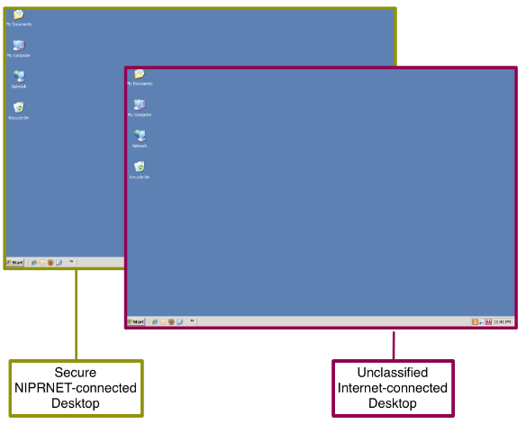

> (The following post continues the conversation from 
> [Gentlemen Do Not Open Attachments](2010-05-a.html).)

### 1. Thin Client Case

A person with a ".mil" address walks up to a thin client anywhere in
the world and logs in to the DoD NIPRNET "Secure Desktop" using a
Public Key Infrastructure (PKI) access card, plus biometric ID. A thin
client then presents a menu of available virtual computers to connect
to. The choices will include secure NIPRNET-connected desktops, as
well as insecure desktops connected to the Internet, as illustrated
below:

One can choose more than one of the available options, keeping them open in multiple windows and switching among them. Each of the windows can run in an overlapping mode, or take over the whole screen. Alternating between windows does not require the rebooting the computing device.

It is not possible to transfer files from a "Secure Desktop" to the "Publicly Connected Desktop." It is not possible to cut and paste from a secure window to a public Internet window. Data transfer is limited to keyboard entries and to mouse movements.

An insecure device such as a digital camera or a "thumb drive" can be connected to the thin client's USB port. However, this port is only active when the "Publicly Connected Desktop" is in the foreground.

All communications from a "Publicly Connected Desktop" pass through a separate security gateway, where they are automatically inspected for policy compliance and will be logged in (for compliance with records management policies) for further examination. Accesses to all physical media (hard disks, flash drives, CD/DVDs or USB ports) are disabled meanwhile although authentication can be obtained from a Network Control Center in exceptional cases. When the desktop is switched from the "Publicly Connected Desktop" back to the "Secure Desktop" the USB port that communicates directly with the Internet is deactivated and reverts to security compliance that is governed by DoD policies.

The servers that run the "Secure" or "Publicly Connected" desktops do not ever combine secure and insecure Virtual Computers into a pool, since servers with different levels of security are always isolated. This can be accomplished by resorting to the use of "hypervisors" that can separate secure and insecure desktops on the same physical server. Hypervisors are good at creating a secure isolation of applications and operating systems from the underlying "bare metal" microprocessors. Hypervisors are the means for achieving the "virtualization" of servers and for delivery of a high level of security assurance such as guaranteeing anti-malware protection.

### 2. Desktop, Laptop and Netbook Cases

A person with a ".mil" address has a personally issued device such as
a desktop, laptop or smartphone and logs in to the "Secure Desktop"
using a PKI access card, plus biometric ID. The computer boots either
into a secure Operating System or to a secure hypervisor, which have
been hardened against tampering and eavesdropping. For instance, the
hypervisor ensures that the disk images of protected Virtual Computers
are encrypted and that there are no means of transferring data into or
out of the protected environment.

After that the procedure is identical with Case 1 above, although some
of the Virtual Computer logic will be stored locally and some parts
will be stored on DoD servers in DoD data centers in order to improve
response time.

Downloads from public Internet sites remain on the "Publicly Connected
Desktop" but cannot be extracted or copied into the secure
desktop. When the "Secure Desktop" is in the foreground, all
input/output actions are restricted by NIPRNET security policies.

Whenever connecting through the "Publicly Connected Desktop" its
settings are either reset to a like-new condition or can be refreshed
according to practices managed by a Network Control Center.

> Paul A. Strassmann is a Distinguished Professor at the George Mason
> University. He is the former Director of Defense Information, Office
> of the Secretary of Defense.
