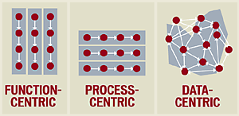

The cost squeeze is
on. Automobile companies are racing to get slimmer. According to
<i>The New York Times,</i> automakers are now ranked according to how
few hours they spend building a car. For instance, General Motors
claims to be the leader, with only 35.2 hours per vehicle. Chrysler
puts in 37.42 hours. Ford takes 38.6 hours. They're all keeping an eye
on the efficiencies of Toyota, which assembles cars in Fremont,
Calif., in only 21.92 hours while gaining market share.

Every company in the world is now engaged in a race to reduce
costs. The hours-per-car statistics are revealing because they reflect
the extent to which outsourcing takes place. GM looks good because it
outsources more than Ford: 76.2% of revenue vs. 70.2%. You can always
show an improvement in productivity by getting others to do your
work. For instance, the current claim by GM that it reduced IT costs
as a percentage of revenue doesn't necessarily attest to the company's
improved efficiency. It only proves that GM has shrunk its value-added
and therefore doesn't need to spend more on IT.

Calculating the cost of GM's 35.2 hours per vehicle raises a more
interesting question. GM's average labor cost, which includes
managerial and executive compensation, is $33.30 per hour. That means
GM puts $1,172 of labor into a car that it sells, on average, for
$30,500. Even after paying for depreciation and taxes and making an
allowance for relatively slim profits (another $6,087), this leaves
$23,241 of purchases to be managed for greater efficiency.

Taking a purely intracompany view of the scope of IT would,
however, be a mistake. The emphasis in global competition is now
shifting from the costs of a company's products to the consumer's
life-cycle total costs of ownership. In the case of a $30,500
automobile, that requires adding the costs of distribution and the
customer's five-year expenses for taxes, insurance, financing,
registration fees, maintenance, repairs, oil and fuel. That raises the
consumer's cash costs of an average GM car to at least $73,600. 

As I calculate the consumer's life-cycle costs of $73,600, I find
that IT can't account for more than 6% of the total expenses. The
costs of information management would be about 30% if added up for
suppliers, manufacturing, management, dealers and the consumer's
ownership. As manufacturers shift costs to suppliers, as management
shifts costs to manufacturing and as customers shop around for the
best deal, every reshuffling of how money is spent ultimately affects
all others. The cost of parts will influence maintenance and insurance
costs. The cost of the car will influence taxes and
depreciation.

In the global marketplace, all costs become interdependencies,
often involving hundreds of businesses to deliver a single
product. Therefore, the management of IT over the next few decades
will be shaped by the need to extend the boundaries of corporate
information systems from the traditional corporate-centric orientation
to delivering consumer-centric services. For instance, in the case of
an automobile, this will require setting up lifetime configuration
management databases for preventive maintenance, repairs, parts,
upgrades, warranties, financing, registration, insurance and fuel
management.

The concept of global life-cycle support of products and services,
as seen from the consumer standpoint, will become the dominant theme
of IT management.This will require an architecture that assures data
interoperability over the entire value chain. For instance, the
reliability of parts must be traceable over a complex chain of
ever-changing suppliers. Preventive maintenance records will have to
travel as a vehicle passes from owner to owner. Accident records will
have to be integrated with insurance and repair records.

Identical reasoning also applies to pharmaceuticals, medical
services, food, banking, refrigeration and airplanes. The CIOs who
succeed will extend the positioning of IT from the corporate back
office (an overhead cost) to a customer life-cycle support view (a
company's core competency).

The current introspective, function-centric and process-centric
systems architectures will have to be replaced by data-centric designs
that assure interoperability of data that's independent of technology,
location or organization.

Implementing such a transition will be the challenge for all IT
executives in the future. Meanwhile, the IT industry, the CIOs and all
of the naysayer gurus should be put on notice that the best of IT is
yet to come. 

---

[Paul A. Strassmann](mailto:paul@strassmann.com) has served as a CIO
long enough to recognize that the full potential of IT is ahead, not
behind us.

