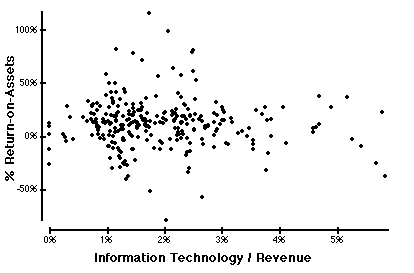
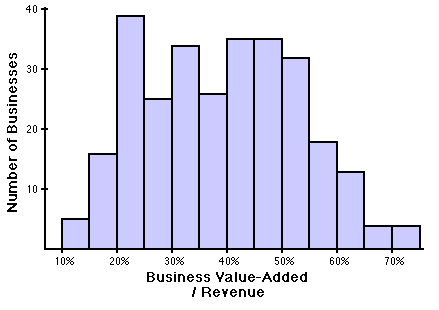
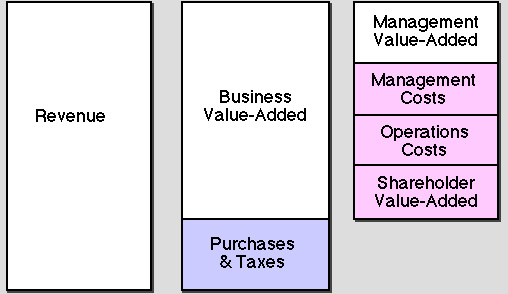

# <a name="Top">Introduction to ROM&reg; Analysis: Linking Management Productivity and Information Technology</a>

___

### Contents

 * [Introduction](#part3)
 * [About Measurement](#part4)
   * [Goal-Setting and Measurement](#part5)
   * [The Productivity of Information Systems](#part6)
   * [Physical Measures of Productivity](#part7)
   * [Problems in Reporting on Physical Productivity ](#part8)
   * [Omission of Management from Productivity Measurement](#part9)
   * [Financial Measures from the Industrial Era](#part10)
   * [The Project Authorization Bias](#part11)
   * [Post-Industrial Development](#part12)
   * [Measuring Management Productivity](#part14)
   * [Finding Management Value-Added](#part15)
   * [Adjusting for Purchases](#part16)
   * [Adjusting for Shareholder Value-Added](#part17)
   * [Adjusting for Business Costs ](#Part18)
 * [Computing R-O-M&trade; ](#part19)
 * [R-O-M&trade; Diagnosis](#part20)
   * [Collection of Standard Data ](#part21)
   * [Comparison Against a Data Base](#part22)
   * [Security](#part23)
 * [Strategic Business Report](#part24)
 * [Management Productivity Report](#part25)
 * [Employment Characteristics](#part26)
   * [The Management or Operations Categories](#part27)
   * [Employment Table ](#part28)
   * [Cost Structure Tables](#part29)

Click here to see the [Information Productivity&trade; rankings](../ip-rankings.html)
of 549 companies from 1993.

<h2><a name="part3">Introduction</a></h2>

<b>There is no relationship between expenses for computers and business
profitability.</b> Similar computer technologies can lead either to monumental
successes or to dismal failures. 

The purpose of this diagnostic service is to shift attention from information
technology to the effectiveness of the executives who manage it. The discovery
of the business value of computers lies in their linking with the business
plans. Computers on which you run information systems can deliver productivity
gains if they are explicitly connected to overcoming existing business problems
and supporting competitive objectives. In isolation, they are just pieces of
metal, plastic or glass. The contributions of information technologies to
increasing the <i>Management Value-added  </i>ratio to <i>Management Costs</i>
, that is <i>Management Productivity</i>, will tell you if computers produce a
business payoff.

Measuring <i>Management Productivity</i> is the key to knowing how to invest in
information technologies. Correctly diagnose conditions that will improve
<i>Management Productivity</i>  before you re-systemize, reengineer or
automate. Make management more productive, by electronic means, if you know
where, when and how. Automate the business processes that are directly linked
to the success of the business.

The <i>Management Productivity</i> diagnostic practice has its origins
in studies [Strassmann, <a href="http://www.strassmann.com/iep/business-value.html">The Business Value of Computers</a>]
that questioned why the relationship between profitability and
computer spending appeared to be random:

The lack of correlation between information technology spending and
profitability is contrary to advertised claims. It defies the common belief
that investing in electronic processing of information somehow leads to lower
costs and results in competitive advantage. 

Should these findings create doubt about the rapidly rising computer budgets of
the last 30 years? Without good answers as to how to validate their gains,
corporate executives kept voting with their check books to automate their
activities on a scale that exceeded in scope and speed anything in history.
Computer budgets increased faster than purchases for any other class of
equipment and now exceed the profits for half of the firms that employ them.
Failing firms did not lag behind superior firms in the rush to install the best
and latest computing equipment. There are unprofitable companies that spend
more money on computers than similar firms that realize large profits. Does
that signify that the decisions to purchase information technology is unrelated
to results? Research, on which this diagnostic method is based, suggests that
corporate over-achievers differ from under-achievers. They also manage their
computers differently.

Conventional financial ratios are unsatisfactory for measuring the benefits of
information systems. Companies competing in equivalent markets, with a similar
capital structure, with comparable production technologies and the same
computer models can deliver remarkably different financial results. This
diversity is attributable not to computers but to <i>Management
Value-added</i>. Since the management of information is inseparable from
management's general roles. We view the processing of information by electronic
circuitry as an extension of traditional management roles, by other means. 

This diagnostic methodology is addressed to those executives who are trying to
extract business value from their investments in computers. After applying it,
clients should have greater confidence in deploying information technologies in
assisting their organization to achieve its goals.
<h2>
<a name="part4">About Measurement</a></h2>
<h4>
<a name="part5">GOAL-SETTING AND MEASUREMENT
</a></h4>
Misapplications of technology occur when goals and actions are confused.
Organizations launch projects for &quot;giving personal computers to all
salespersons,&quot; &quot;automating clerical labor,&quot; &quot;converting from batch-processing
to on-line systems,&quot; &quot;introducing artificial intelligence into decision support
applications&quot; or engaging in the building of an &quot;executive information system.&quot;
By not separating the validity of goals from the implementation, the conflicts
between ends and means will confuse even the best-intended schemes.

The problem is that complete goal-validation, such as a detailed commitment to
getting specific benefits, is a painful process. The appraisal of a particular
goal is possible only if the goal is clear, measurable and supported by
verifiable cases. Most importantly, verifiable goals specify how we will
measure the result of our efforts after we complete the intended project. 

Coming up with proof that the desired goals were reached is a tough assignment.
That is hard to do, especially if the proposed technology project needs support
from constituencies who have conflicting needs, opposing interests and diverse
qualifications in considering the merits of the proposal. In the public sector,
such projects are carried by contention between competing Agencies. In the
business world, they are compromises arising from the annual budget process
which favors the dressing up of goals into acceptable projects. Unless an
information technology has measurable financial outcomes, the clarity of its
goals is questionable.

When you introduce computers into an organization, their effects are systemic,
affecting the working of the whole company. The consequences will modify the
way the firm operates. Because of this, measurements must reflect the
aftereffects of many changes, instead of just one isolated improvement. It is
relatively easy to achieve simple goals by sacrificing others. The effect of
increasing market share will ripple through every Department. Production,
personnel, manufacturing and distribution functions never will be the same.
This raises the issue of goal-setting for information technology investments:
what principles help us examine a proposal for changing systems that manage an
organization? 

The answer is that you should measure the <i>productivity</i> of organizations
before and after automation. Gains in organizational productivity would tell us
if the new system improved overall performance, because the overall advantages
outweigh the overall disadvantages. What then is the meaning of organizational
<i>productivity</i> in an information-based company?
<h4>
<a name="part6">THE
PRODUCTIVITY OF INFORMATION SYSTEMS
</a></h4>
The term <i>productivity</i> is about two hundred years old. At the start of
the industrial revolution, factory owners needed a quick way to assess
operating results without having to wait for financial reports. Productivity
was output divided by input. For example, if a blast furnace produced 10 tons
of steel per worker, and next year the same furnace produced 11 tons of steel
per worker, labor productivity increased by 10%. 
<h4>
<a name="part7">PHYSICAL
MEASURES OF PRODUCTIVITY
</a></h4>
Under the influence of Frederick Taylor the measurement of efficiency and
productivity came to the factory floor. Productivity was re-defined as the
physical <i>output</i> produced with a given number of physical <i>inputs</i>.
For example, the number of shafts, bearings or carburetors produced per
work-hour or man-week would be a measure of direct labor productivity. The
whole idea of physical productivity also applied to national economic
measurements. Today, U.S. productivity is a weighted mix of physical outputs
(tons of steel or paper, kilowatts of electricity, etc.) divided by a weighted
mix of labor inputs, such as hours worked. In addition, national productivity
includes an allowance for capital inputs, such as the reported financial value
of physical assets.

This measurement of productivity was satisfactory when the country's main
economic activities were agriculture or manufacturing and when physical outputs
were comparable to similar physical inputs at an earlier time. A bushel of
wheat or a ton of pig iron did not change much over the period when comparing
productivity results.

During the 1930's quality began to displace quantity as a critical factor in
advanced industrial economies. As a result, imperfections in the measurement of
productivity started creeping in. Automobiles and convenience foods sold in
1960 or 1970 were not equivalent to those produced in the 1930's or 1940's. The
labor-intensive assembly lines of the pre-World War II factories were not
comparable to the highly engineered production processes thirty years later.
Accurately measuring gains for the number of automobiles or tons of
freeze-dried vegetables could not be done, because dissimilar outputs were
produced with different inputs. Similarly, a computer in 1989 is not comparable
with a computer in 1979 or 1969, regardless of how we try to define their
equivalence in millions of instructions per second per dollar.
<h4>
<a name="part8">PROBLEMS
IN REPORTING ON PHYSICAL PRODUCTIVITY 
</a></h4>
After 1970, serious difficulties in interpreting productivity numbers began to
surface. In advanced industrial societies, the manufacturing sector declined as
the origin of <i>Value-added</i> shifted from production (reported in the
manufacturing sector) to distribution (reported in the service sector). When a
steel company shifts its warehousing to a distributor, this appears as a loss
to the production sector and a gain in the services sector.

The automation of a factory reduced the direct labor force, and therefore
presumed to improve productivity. But, for every factory worker displaced,
there were now two other people employed in the company's offices. These
changes appeared in corporate productivity calculations as gains in
manufacturing productivity. The offsetting productivity declines from office
work did not get reported, because no means were available for measuring the
outputs of the rising office population. You had inputs (office costs) but no
easily identifiable outputs. Without output estimates you cannot come up with
useful measures of productivity.

Some banks and insurance companies have re-organized themselves on the model of
paper-work factories. They began measuring the productivity of clerical
personnel using the principles of industrial management. Detroit
time-and-motion study engineers found employment in New York offices when
computers were introduced on a massive scale. The industrial engineers
succeeded only in streamlining clerical labor. They failed in dealing with the
rising costs of professional staffs which were excluded from productivity
calculations because their output was intangible.

The traditional formula for determining &quot;productivity&quot; as a critical business
indicator was at a dead end. Nobody knew how to calculate the gains, if there
were any, caused by the growing costs of information work. Without a generally
accepted correct measure of productivity, you could not support massive
investments in computers. The stage was set for the approaching decline in the
seemingly unlimited appetite for more information technology.
<h4>
<a name="part9">OMISSION
OF MANAGEMENT FROM PRODUCTIVITY MEASUREMENT
</a></h4>
The fastest rising and the most expensive labor costs - executives, managers,
administrators, professionals and officials - whom I designate as
<i>Management</i>, were omitted from all productivity calculations.
<i>Management</i> was overhead, with &quot;intangible&quot; and &quot;immeasurable&quot; physical
results, and therefore had been exempt from the measurement of their
<i>outputs</i>. &quot;White collar&quot; productivity studies concerned only the work
products of clerical and secretarial personnel. It was acceptable to claim
savings from reducing fully burdened clerical and secretarial labor hours, even
if this added to the size of managerial and professional staffs.

The widespread adoption of computers made the misjudgments of productivity only
worse. Computers generated outputs for which internal customers often did not
pay. Computers also supported people delivering intangible advice to
<i>Management,</i> whose output also was intangible. This meant that the
economy began absorbing large quantities of information-processing capital
unrelated to the generation of profits. Legions of specialists attending to the
needs of overhead personnel joined the payroll. Productivity was no longer the
traditional concept of a ratio of physical <i>outputs</i> to <i>inputs</i>.
<i>Output</i> was indeterminate and <i>input </i>was an untraceable overhead
expense.

The first twenty years of euphoric acceptance of computers ended when overhead
costs (including supporting capital) surpassed direct labor costs (including
their supporting capital) in the service sector. Since the immeasurable became
the largest <i>input, </i>physical<i> </i>productivity ratios ceased to have
any meaning.
<h4>
<a name="part10">FINANCIAL
MEASURES FROM THE INDUSTRIAL ERA
</a></h4>
Because there were no valid measures of productivity, investments in computers
were justified only in strictly financial terms. Corporate procedure already
was familiar with filling out similar forms for the approval of fork-lift
trucks, the building of warehouses and the buying of a new milling machine.
Forms for acquiring information systems also took on the same appearance. These
forms are much alike, regardless of the industry or the country. They differ
only in detail as to calculating and documenting <i>ROA</i> (return on assets)
or <i>ROI</i> (return on investment). 

Every method for computing <i>ROA</i> or <i>ROI</i> goes back to the eighteenth
century, when capital was the most important element in organizing the
industrial means for production. According to this view, all profits created by
a company are possible because of capital. Labor was a commodity.
<i>Management</i> was overhead to the costs of labor. Therefore, <i>ROA</i> and
<i>ROI</i> are the essence of free-market as well as planned economies, for
they calculate the efficiency with which you use capital. Following this
outlook, the financial analysts, the stock market and your shareholders will
judge you primarily by your capital efficiency and not by the efficiency of how
you utilize your human resources.

To come up with the financial measure of productivity is simple: you divide
profit (the final <i>output</i> of any enterprise) by capital (the decisive
<i>input</i> to any enterprise). Labor, management, land and material
<i>inputs</i> are bought at commodity prices. What counts then, is capital. If
capital is well invested, you get productivity.

This explains why management theorists until now have been primarily concerned
with the efficiency of using capital. That was acceptable prior to the
introduction of huge administrative staffs. Management's concentration on
capital budgeting was essential. The capacity to manage capital resources meant
having access to more capital for large plants to produce steel, refine oil,
generate electricity and make appliances. An adequate supply of inexpensive
capital was a prerequisite for gaining market share through production and
distribution efficiencies. The fascination with the acquisition and management
of capital obscured the understanding that the annual costs of corporate
bureaucracies were becoming more expensive than the annual carrying charges for
capital assets.
<h4>
<a name="part11">THE
PROJECT AUTHORIZATION BIAS
</a></h4>
The concentration on capital investment changed the ways of managing
innovation. Management focused on capital budgeting as the place where they
could exercise maximum influence over the future directions of a business. Once
a capital investment was approved, the operating expense would then follow from
the initial investment decision. Therefore, the annual costs would not be
amenable to major changes. As a consequence of such thinking, all innovation
required estimation of expected benefits and costs with reasonable confidence

When such investment-oriented logic was applied to computer projects, it
resulted in elaborate, lengthy and tortuous approval procedures. In the absence
of reliable productivity measures industrial-age executives became convinced
that the preferred way to control computers was through project authorization
procedures which reduced the risks of computerization to a minimum. This
resulted in favoring projects that automated existing business procedures
instead of changing them to take advantage of the new information-handling
methods. Investment-oriented executives failed to recognize that
computerization is an incremental, continuous and evolutionary organizational
learning process that requires better controls over operating results for the
entire business. Cumbersome project review procedures produced elongated
development schedules, and created a tendency to combine long overdue
incremental improvements into a single costly project. Emphasis on controlling
new investments led to the establishment of the information system as a
discrete and separate function, instead of integrating it into every manager's
job.

Executives who rely primarily on project authorizations to control computer
spending are focusing on a diminishing fraction of total costs. As soon as the
annual growth rate in information technology spending slows down below 10%,
less than 20% of the total budget would be available for new development. The
rest of the budget goes for ongoing maintenance and inflationary salary
increases. The share of capital expenses for any new information technology
development is also very small, because most of the cost of installing new
applications is in systems analysis, coordination and training. Relying on
project authorizations of information technology hardware investments as the
principal method to guide the application of computers becomes irrelevant.
<h4>
<a name="part12">POST-INDUSTRIAL
DEVELOPMENT
</a></h4>
By 1980, global competition created excess production capacity for nearly every
product or service. Rapidly accumulating profits were seeking out opportunities
for re-investment. The globalization of financial markets created conditions
where capital became a readily traded commodity, not a scarce resource.
Hundreds of billions of dollars moved electronically, on a moment's notice,
from country to country whenever there was a small change in the price of
capital. When international financial transactions exceeded international trade
by a multiple of 20 or more, finance capital ceased to be the prime explanation
for value creation. Capital was now a commodity, like everything else.

The scarce resources today are people who can organize and motivate the
productive capacities of their employees, and who know how to maximize the use
of capital. The scarce resource of the post-industrial world is
<i>Management</i>. If a company is profitable, this is because of
<i>Management</i>, and not because of capital. One can determine
<i>Management</i> costs by first identifying all <i>Operations</i> costs, which
are all resources that are essential for serving today's customers. Everything
not in <i>Operations</i> is, by definition, <i>Management:</i>

<pre>
    <b>Operations</b>                      <b>Management</b>           
  How to do                       How to organize          
  Doing the things right          Doing the right things       
  Today's business                Tomorrow's business        
  Structured tasks                Unstructured tasks         
  Today's decisions for today     Today's decisions for future    
  Workflow shapes decisions       Decisions shape workflow      

<a name="part13"><b>The Characteristics of Operations and Management</b></a>
</pre>

Companies in the same industry, with the same technology and same capital
structure, can have widely differing profits. research found that high capital
intensity is always harmful to profitability. Therefore, measuring business
productivity only by means of capital productivity ratios will not reflect the
real causes for generating profits.

The modern enterprise employs large numbers of computer-supported managers.
Measuring its capital productivity will not tell us much about this critical
resource. Measuring the productivity of its direct labor is also insufficient.
Reporting automobiles produced per worker per year does not tell us much about
what cars are being produced with robots. Boasting about gains in clerical
productivity will be equally misleading. 

If management is the scarce resource, and if management is the key to the
productivity of organizations, why not measure &quot;management productivity&quot;
instead of &quot;capital&quot; or &quot;labor&quot; productivity? This approach would be different
from the way today's economists or accountants think about evaluating business
results. 

Most importantly, measuring <i>Management productivity</i> would open the way
to exploring the benefits of computers used by their principal customers, the
managers of information.
<h4>
<a name="part14">MEASURING MANAGEMENT PRODUCTIVITY
</a></h4>
The measurement of organizational productivity is only possible if we consider
how well a firm's leadership guides the business so that the employees'
contributions remain constructive. How well management manages, over an
extended period of time, is the aim of measuring <i>Management
productivity</i>. 

From a shareholder's standpoint, management - not capital - should be the
investment that needs watching. From the shareholder's standpoint, the only
evaluations that make sense concern the effectiveness of management.
<i>Management productivity</i> answers the following question: for every dollar
spent on management, how many dollars of net gain accrue to the shareholders?

Computers primarily serve management and control purposes. Because the use of
information technology is not evenly distributed among workers, we can get a
better understanding of its effectiveness by separating its managerial uses
from other applications. We can then evaluate the effectiveness of
<i>Management </i>with or without computers. We can also isolate cases showing
superior managerial productivity, and then examine their characteristics of
computer use that differ from cases that show inferior managerial
productivity.

Research extending over a period of 10 years led to the concept of
<i>Return-on-Management&trade;. </i>
This ratio does a good job not only in evaluating information technology,
but also in identifying excessive overhead costs. This ratio is calculated by
first isolating the <i>Management Value-added</i> of a company, and then
dividing it by the company's total <i>Management</i> <i>Cost</i>s:

<b>Return-on-Management&trade; = F(Management Value-added,Management
Costs)</b>

<b></b><i>Management Value-added</i> is that which remains after every
contributor to a firm's inputs gets paid. If <i>Management Value-added</i> is
greater than <i>Management Costs,</i> you can say that managerial efforts are
productive because the managerial <i>outputs</i> exceed managerial
<i>inputs</i>. 

Another way of looking at the <i>Return-on-Management</i> ratio (<i>R-O-M&trade;
Productivity Index</i>) is to view it as a measure of productivity. It answers
the question of how many surplus dollars you get for every dollar paid for
<i>Management</i>. 

<b>R-O-M&trade; Index = F(Management Output,Management Input) = Management
Productivity </b>

<b></b>To attribute all surplus value to <i>Management,</i> instead of capital
or labor, is a departure from classic economics. It is <i>Management</i> that
makes the investment and pricing decisions. It is <i>Management</i> that
motivates the employees. It is <i>Management</i> that chooses products and
markets. It is <i>Management</i> that organizes the suppliers  and the
production and delivery of goods to customers. Good <i>Management</i> can get
more of the capital it needs, at a lower interest, than poor
<i>Management</i>.

The scarce resource of contemporary society is not capital or technology, but
<i>Management</i>. The time now has come to begin measuring it explicitly.
<i>Management Productivity</i> is not apparent from capital-based financial
ratios that only tell us something about <i>Management</i> by proxy.

The theory behind this concept comes from the idea that information (e.g.,
<i>Management</i>) is a disorder-defying phenomenon which assures survival of a
firm in a competitive environment. Without the continuous intervention by
<i>Management</i> every enterprise must perish from chaotic conditions which
arise when external information (about customers and competitors) and internal
information fails to guide people in what to do. When that happens people
cannot cooperate in bringing in new revenues.

According to laws of thermodynamics, machines always produce less energy than
they consume. <i>Management</i> has the capacity to construct a device - an
organization - that extracts from a hostile environment <i>Net Value-added</i>
(<i>Outputs</i>) in excess of total costs (<i>Inputs</i>). A well-managed
organization is superior to any engine ever invented. A profitable corporation
generates a net surplus of wealth. For effective organizations, <i>Output</i>
always exceeds <i>Input,</i> which defies the law of physics that states that
this is impossible and disorder must ultimately prevail. Our civilization has
created an enormous accumulation of wealth, because <i>Management</i> has
learned how to increase cooperation through organization of its productive
resources. 

How to measure a phenomenon that must generate a positive <i>Net
Value-added</i> to survive<i> </i>is central to the issue of what
<i>Management</i> is all about. For the last two hundred years, management was
evaluated by its capacity to extract new surplus (profits) out of past
accumulations of profits (invested capital). Since smart management can get all
the capital it can use, the old formulation can now be replaced by directly
measuring the productivity of <i>Management</i> as an information-processing
function. We measure the <i>Output/Input</i> ratio by finding what's left after
<i>Management </i>pays everyone, and dividing that by the costs of managing the
<i>Net Value-added</i> creation process. This is why it is critical to find how
much information (<i>Management</i>) is necessary to run an enterprise.

Companies that can extract more <i>Net Value-added</i> from the marketplace,
while consuming less information to accomplish this feat, will be the winners.
The question of what is information effectiveness resolves into finding how
much <i>Net Value-added</i> can be created with the smallest combination of
managers and computers. Measuring <i>Management Value-added</i> is then the key
to evaluating organizational performance and to measuring the effects of
computers on management information systems.
<h4>
<a name="part15">FINDING
MANAGEMENT VALUE-ADDED
</a></h4>
Finding the <i>Management Value-added</i> is similar to extracting gold from
rocks or river sand. First, you sift out large pieces of matter that clearly do
not belong. After that, you do not assume that whatever is left is gold because
there is still too much extraneous matter. You concentrate on removing foreign
material, making sure that in the process you do not accidentally discard
anything that is valuable.

<i>Management Value-added</i> is the purified residue of a winnowing process.
You obtain it if you have exercised good care in removing all variables that do
not belong.
<h4>
<a name="part16">ADJUSTING
FOR PURCHASES
</a></h4>
As the first step in the cost-separation process, remove from <i>Revenues</i>
the costs of <i>Purchased Raw and Finished Materials, Parts, Energy and
Services</i>. These essential inputs are managed by somebody other than the
firm's management. Their prices already reflect the suppliers' management
costs.

Next,  subtract the cost of <i>Interest</i>.. Interest payments are just like
payment for any other service. In this case, the supplier is usually a bank.
Effective management will pay less for loans than an unreliable one. What
matters is the incremental <i>Value-added</i> that management creates with
loans. In this respect, the money that management obtains is not different than
any other rental contract for equipment or services.

Next, subtract all <i>Taxes</i>. Profit after taxes is the indicator that
matters to the shareholder. Subtract taxes directly from revenues - before, not
after other expenditures - because government makes sure it gets paid before
anybody else. In this way taxes become payments to the most insistent supplier.
All taxes are then an <i>involuntary purchase</i>. Allocation from headquarters
is also a form of imposed taxation and must be subtracted from <i>Revenue</i>.
What remains is the <i>Business Value-added</i>. 

It is revealing to examine the enormous range in <i>Business Value-added</i> as
a percentage of <i>Revenue</i> for manufacturing firms:

<b></b>

In our analyses all productivity evaluations will be based on
<i>Business Value-added</i> instead of on <i>Revenue, </i>because companies
with a high degree of vertical integration (a high <i>Business
Value-added/Revenue </i>ratio) can justify more <i>Management</i> than those
with a lower level of integration. Productive executives are likelier to make
better choices on the mix of what to buy and what to make. They can then
support the additional costs of coordination and integration, provided that the
incremental value-added is greater its incremental costs. 

Superior management also can get better prices for their purchases. This
translates into improved <i>Business Value-added</i>. Choosing efficient
suppliers, especially in manufacturing, offers the greatest possible
opportunities for profit improvement because purchases will be the largest cost
element. <i>Value-added</i> analysis becomes the key to judging the worth of
computer investments that support buying activities.

Focusing on <i>Business Value-added</i> gives an unobstructed view of the scope
of a firm's managerial activities. It is unfortunate that accounting practices
fold into the cost-of-goods an indistinguishable mixture of direct labor,
production overhead and purchases so that it is hard to tell whether the
company is increasing or decreasing value-added. For value-added analysis, you
must first extricate from the cost ledgers external purchases. Clients used to
value-added concepts do not have these difficulties, because taxation rules
dictate value-added financial reporting as a matter of routine.
<h4>
<a name="part17">ADJUSTING
FOR SHAREHOLDER VALUE-ADDED
</a></h4>
After paying suppliers for their share of inputs, <i>Management</i> has to
account for the shareholders' value-added. The major distortion in the
<i>Return-on-Asset </i>calculations is that ROA for low-debt businesses will be
higher when compared with high-debt businesses. Calculating the
<i>R-O-M&trade;</i> Index adjusts such comparisons by subtracting from the
<i>Business Value-added</i> the going rate of the costs of shareholder capital,
multiplied by the market (or book) value of shareholder equity. This
calculation is identical with the current approach to calculating the cost of
capital for the Economic Value Added (EVA).

Subtracting the going rate of shareholder capital costs from after tax profits
is another way of computing the economic &quot;rent&quot; for capital. It is also known
as the &quot;economic profit&quot; of a firm, which is different from the usually quoted
number known as &quot;operating profit.&quot; According to this view, shareholders'
economic profit, or economic rent, is equal to operating profits minus interest
costs, minus the investment revenues a company's assets could earn if employed
elsewhere. Such rent can be also calculated by estimating the breakup value of
a firm, and multiplying that with an interest rate that can be earned in a
comparable investment.

Regardless of the technique used for computing the shareholder
<i>Value-added</i>, it is essential that it reduces reported accounting
profits. Otherwise, the financial reports overstate the contributions by
<i>Management</i> and could end up paying bonuses on <i>Value-added</i> which
rightfully belongs to shareholders.
<h4>
<a name="part18">ADJUSTING
FOR BUSINESS COSTS 
</a></h4>
Day-to-day <i>Operations</i>  are paid for next. These include the fully
burdened costs of employee payrolls, asset depreciation and interest.
<i>Operations</i> include everything that is essential for getting today's
goods and services produced and delivered to today's customers. 

<i>Management Costs</i> are calculated by considering that everything that's
not in <i>Operations</i> automatically is placed in this category. The
<i>Management</i> <i>Value-added </i>is <i>Revenue</i> minus <i>Purchases</i>
minus<i> Shareholder Value-added </i>minus the <i>Costs of Operations</i> minus
the <i>Costs of Management</i>. 

The following diagram should help in understanding cost elements for deriving
the <i>Management</i> <i>Value-added</i>:

In favorable cases the <i>Management Value-added</i> can be a large
multiple of <i>Management Costs.</i>  There are firms where for every dollar
paid to <i>Management,</i> they create two or more dollars of surplus
<i>Management Value-added</i>. The unhappy aspect of <i>Management
Value-added</i> is that it can be less than zero. Over 20% of firms showed a
negative <i>Management</i> <i>Value-added, </i>although more than 50% of those
still report profits and a positive R-O-A,<i> </i>using generally accepted
accounting principles. 
<h2>
<a name="part19">Computing R-O-M&trade;</a></h2>
Data-gathering begins the process for computing standard performance
indicators. Each of these indicators has been tested to give statistically
valid correlations about the relationship between the structure of management
costs and business profitability. The first Part is an outgrowth of empirical
work done since the early 1970's at the General Electric Company, the Strategic
Planning Institute (PIMS) and now continuing at the MANTIS (Management Tools
and Information Services, Inc.) research consortium . 

Part 1, <i>Critical Characteristics</i> is identical with the short form of
strategic analysis as used by the MANTIS organization as a <i>Strategic
Business Analysis</i> report. Clients may opt to fill out a more elaborate
questionnaire to get more diagnostic indicators dealing with matters of
marketing strategy.

Part 2, <i>Management Productivity Characteristics</i> will collect data needed
to compute the value of R-O-M&trade; and to come up with insights about the
effectiveness of overhead expenses.

Clients may also wish to apply R-O-M&trade; techniques in analyzing major
investment proposals involving information technologies. A <i>Functional
Economic Analysis </i>package and a risk-analysis service is also available.

<h2>
<a name="part20">R-O-M&trade; Diagnosis</a></h2>
The aim of the <i>Return-on-Management</i> diagnostic process is to imitate
practices well established in confidential medical testing.

The findings will not produce specific action recommendations. Taking
historical statistics and from that generating a specific prescription what to
do is not feasible. The goal is to offer well-researched ratios which compare a
client's actual business characteristics against a range found in comparable
organizations. The goal is diagnose those distinctions that suggest what may be
detracting from the capacity of a business to reach its profit potential. 

In sound medical practice clinical testing always precedes the prescription of
a specific therapy. The same approach applies in dealing with managerial
pathologies. Information technology should not be examined as a machine tool
but as a pharmaceutical. With proper diagnosis, the right timing and the
correct dosage pharmaceuticals can produce miraculous results. If applied
incorrectly, they can kill you. 
<h4>
<a name="part21">COLLECTION
OF STANDARD DATA 
</a></h4>
To get comparable data across a range of industries and in different countries,
all data definitions are standardized. Most of the information called for in
filling out these forms is routinely available from existing accounting data
and from marketing research sources. 

The R-O-M&trade; data form requires to split costs for <i>creating</i> the
customer value-added from costs incurred in <i>supportin</i>g the delivery of
products and of services. The forms also instruct how to allocate information
technology costs to business functions. To document how the original accounting
data is distributed create a spread-sheet which tracks all changes.

When a client experiments with R-O-M it is sometimes possible to take a few
short-cuts. For some industries I have enough purchase-to-revenue ratios so
that, my computer can estimate the likeliest total value-added. If this
approximation turns out to be important I will ask for the actual purchase
costs.

 Though the data-gathering forms should be self-explanatory analysts will need
help in interpreting some data definitions. They also may have difficulties in
discerning what is the called for accuracy of a few non-accounting numbers.
Clients have direct access to me either by facsimile, by telex or by electronic
mail to resolve any questions without much delay. 
<h4>
<a name="part22">COMPARISON
AGAINST A DATA BASE
</a></h4>
 From many case studies we have identified correlations between the R-O-M&trade;
measure of productivity and <i>critical performance ratios.</i> Some of these
insights come from research that has its origins in the PIMS studies about
business strategy. Studies about the relationship between overhead costs and
information technology are derived from work done under PIMS auspices (the MPIT
project), and from client engagements.

 After receipt of the finished management productivity forms the data will be
compared with the data-base for a data-consistency check.  Out-of-limit
conditions are identified and the client is contacted to find out whether the
deviant information should be included in the diagnosis. <i>Critical
performance ratios</i> are then calculated from the accepted data and results
compared with information in the R-O-M&trade; and MANTIS data bases as well as
against constantly updated research findings. Great care is taken to assure
statistically reliable comparisons. To that end we recognize differences by
industries (by major standard industry classification categories), differences
by geographic location (USA and Canada vs. Europe), differences by taxation,
differences by capital structure (the debt/equity ratio) and differences in the
costs of equity capital. 

 If a client's case is unique I shall refund half of the fee and the client
will be mailed a comprehensive report showing why he is incomparable.

The entire diagnostic method relies on annual <i>critical performance ratios
</i>and therefore, the results are indifferent to changes in currency or in
inflation. When the annual data contain unusual one-time costs, such as in case
of atypical marketing programs, a discounted cash flow model will compute
equivalent annual costs. 

 For large multi-divisional companies comparisons can be made both against the
general data-base and against a customized data-base if there is a large sample
to make the additional analyses statistically significant.
<h4>
<a name="part23">SECURITY</a></h4>
The extreme sensitivity of the input data and of the diagnostic results call
for precautions equivalent to the handling classified military information. The
following practices safeguard the client's data:

	* The client will be given a randomly picked block of identification numbers.
After that all forms, communications and final reports carry only that number.
If a Client makes an unintentional disclosure all the compromised information
will be returned for re-submission in a different format.

	* Clients may wish to disguise his costs by multiplying or dividing every
number by a constant. For instance, Swedish data can be converted into Italian
liras.

	* Clients should submit their data forms through a third party to prevent
accidental disclosures. This procedure works well when the data gathering and
diagnostic interpretation is done by third parties, such as a trade association
or the corporate staff of a multi-divisional company.

	* All forms, final reports and all interim communications are transmitted by
registered mail. Facsimile transmissions of data need verbal authentication at
both ends.

We are following the same rules as on the PIMS project, where detailed
financial information about more than 2,000 businesses were accumulated over
twenty years without compromising security.

<h2>
<a name="part24">Strategic Business Report</a></h2>
The first thirteen forms in the <i>Management Productivity</i> collection
assemble the key descriptors about the competitive health and about the
financial fundamentals of a business. 

Where accurate numbers are available, such on some line items in the financial
statement that is preferred. Where no accurate numbers are available, such as
for the competitors' market share or product quality, the best estimates by
knowledgeable observers are enough. Where even estimates are difficult to make
a neutral answer is better than no answer. The chances are that many estimates
may not influence the diagnostic findings .   If the neutral answer appears as
an important difference then more effort is required to find out the right
descriptor.

Usually, it will take about three hours per <i>Strategic Business Unit</i>
(SBU) to complete the forms with adequate precision to check out the adequacy
of the information.

In filling out the forms, a few rules are in order:

	* The form should be finished for each <i>Strategic Business Uni</i>t in a
company. An SBU is defined as a coherent strategic entity (i.e., a well-defined
product line going to a well-defined market). It may or may not follow the
lines of Divisional organization. It may share factories or marketing resources
with other SBUs .  If in doubt about how many SBUs  should be recognized choose
the smaller number.

	*. Where accounts need to be allocated to the various SBUs  a simple formula
is always preferred to a complex allocation scheme. The moderate differences
that my be produced by more complicated formulas usually have little effect on
strategic diagnosis.

	* Usually, the allocation of assets, of joint production equipment, or of
joint costs across SBUs  can be done on the basis of value added. Allocations
based on revenue should be avoided unless there is defensible logic behind such
an approach. All support costs--and this applies especially to research,
engineering, systems support and to programming maintenance--should be
allocated using estimates of the resources consumed and not using unrelated
ratios, such as employee headcount or assets. 

	* Market-related questions must focus on the <i>served market </i>of the SBU.
The served market is that segment of the potential total market in which the
business is an active competitor which means having a competitive product and
making an identifiable marketing effort. The relative ranking of the business
and of its competitors (as defined by market shares, relative prices,
innovation and relative quality) must be judged with reference to a
well-defined <i>served market</i>. I find that this part of the diagnostic
forms gives the greatest problems to my Clients, because they tend to forget
the distinctions what i<i>s the total </i>market and what parts they are
participating in.

The first thirteen data forms supply information that g<i>enerates the
Strategic Bu</i>siness Report diagnostic report which is designed to monitor
the competitive health and future financial prospects of the business. This
diagnosis is based on extensive empirical research of businesses with similar
strategic characteristics. 

The <i>Strategic Business Report</i> represents the simplest level of analysis.
It is designed as a communication tool for the CEO, CFO and for the business
management team. Its purpose is to identify where priorities should be placed
and where to focus information technology investments.

<h2><a name="part25">Management Productivity Report</a></h2>
These forms assemble the variables needed to do <i>Return-on-Management
</i>diagnosis. As a rule, accounting precision of the information is
unnecessary until further analysis shows that a data element is critically
important.
<h4>
<a name="part26">EMPLOYMENT CHARACTERISTICS
</a></h4>
<i>Organizational Complexity</i> is an indicator of the information required
for internal and for external communications. Internal complexity is measured
by counting communication layers between the Chief Executive and first level of
supervision. When counting, the layers are inclusive of the starting level
(e.g. CEO) and the recipient's level. 

External complexity is measured by counting the layers how far the Chief
Executive is removed from the customer who ultimately consumes the product or
service. If a business passes goods unchanged through distributors and then
through retailers to a consumer, then the layers between the consumer and the
CEO must be also counted. If, however, the distributor incorporates the product
as a component within another product, then only the layers dealing with the
distributor should be counted. 

<i>Workstations</i> are an indicator of the extent whereto a business depends
on electronic means for communications. 

<i>Working  Hours</i> are reported to make comparisons where different levels
of productivity are shown because of different work practices. 

<i>The Employment Additions</i> are used to calculate employee turnover rates.
This is an indicator of the accumulated knowledge of a work-force.
<h4>
<a name="part27">THE MANAGEMENT OR OPERATIONS CATEGORIES
</a></h4>
This distinction is the key to coming up with the measure of management
productivity. The underlying concept here is that all costs essential for
delivery of today's goods and services are classified as <i>Operations</i>.
Everything  else is automatically defined as <i>Managemen</i>t. The
<i>Management </i>function is seen as supplying the necessary support so that,
<i>Operations</i> can deliver today's output to today's customers. The
<i>Management</i> function also acts today so that<i>, Operations </i>can
deliver tomorrow's output to tomorrow's customers.

In this way of thinking<i> Management, </i>and not<i> Operations</i> are
the engine that drives the future profitability in the same way as today's
profitability is the result of yesterday's management efforts. 

<i>Management,</i> and not <i>Operations</i>:

	* Decide how to apportion revenue between suppliers, employees, shareholders
and debt-holders.

	* Allocate money between today's problems and tomorrow's opportunities.

	* Choose and motivate employees. These are the paramount choices that make the
difference whether a firm ultimately prospers or declines.

	* Choose what markets to compete in, what prices to charge and what prices to
pay for wages, salaries or purchases.

<i>Management</i> is the critical ingredient which makes the difference in
delivering sustainable profits. A standard definition of the total costs of
<i>Management</i> is a pre-requisite for computing a comparable measure of
management productivity. 
<h4>
<a name="part28">EMPLOYMENT
TABLE 
</a></h4>
Classifying  personnel into the Management or Operations categories will
probably involve more discussion than any the other forms.

Never start with an estimate of how many employees are involved in
<i>Management.</i> Care should be taken to first identify only
<i>Operations</i>. These are employees who can be directly and without much
controversy associated with producing revenues. For instance, the hours used in
machining, in assembly of parts, in taking telephone orders, in client billable
time by a lawyer, etc., are clearly cases where <i>Direct</i> <i>Operations
</i>personnel<i> </i>are involved. 

The full time equivalent number of employees is computed by taking direct hours
and dividing them by the net working hours as defined in the Working Hours
characteristics. For instance, a factory operator delivering 1550 direct
working hours per year (e.g., 1550 hours divided by 37.5 hours/week  * 52 weeks
less 6 weeks for vacation, paid holidays and absenteeism) would count as an
equivalent 0.9 employee for <i>Direct</i> <i>Operations</i>.  If the remaining
175 hours are spent in training and meeting attendance an equivalent 0.1
employees should be entered as <i>Management</i>. 

If a consultant bills only 50% of his net available time (the remainder
expended in training, marketing support and recruiting) then only 0.5
equivalent employees would be identified as <i>Direct Operations</i>. 0.5
equivalent employees would be entered as <i>Management</i>.

Do not classify all support functions as <i>Management</i>. For instance, in a
warehouse the transportation dispatcher would be classified as <i>Indirect
Operations</i> if his functions are essential for the goods to move out.
Because the physical transportation adds to the value the customer is paying
for, you can classify the actual time the transportation dispatcher spends in
dispatching goods as <i>Indirect Operation</i>s.

A billing clerk checking up whether the quantities on the loading dock
correspond to the warehouse pick-list should be classified as
<i>Management</i>, since checking for errors in warehouses I have ever seen is
an avoidable managerial procedure. The billing clerks' time spent in checking
for errors adds little value to what the customer is willing to pay for. In
classifying personnel I take the position that all expenses for control,
coordination, error checking, training, meetings and supervision are resulting
from imperfections<i> in Manage</i>ment processes and should be recognized . 

Production equipment maintenance and computer operations personnel (in a
commercial service bureau) who are essential for the production and services to
continue without interruption would be also in <i>Indirect</i>
<i>Operations</i>. 

As a rule, if an individual is essential for the delivery of a
revenue-producing product or service, the time spent on such efforts should be
classified as <i>Operations</i>. If a job is dictated by internal needs, such
as for innovation, for product development, for market research, for materials
testing, for accounting, for personnel and for advertising then the person
should be identified as <i>Management</i> because it is the purpose of
management to take care of activities that will ensure the future of the
enterprise. Special care should be taken to identify the large percentages of
time expended by personnel, ordinarily viewed as <i>Direct</i> or <i>Indirect
Operations</i> on managerial tasks such as meetings and in training.

Proceed in filling out the Employment Table form by first identifying all full
time equivalent <i>Operations</i> personnel. The balance falls automatically
into the<i> Managemen</i>t headcount. 

Remember: if you are not in <i>Operation</i>s then you are in <i>Management</i>.

<h4><a name="part29">COST STRUCTURE TABLES</a></h4>

Purchases should include goods and services supplied by suppliers. This
includes also goods and services got from other Divisions of the same company,
if the purchases are made at competitive prices. Otherwise, all non-competitive
internal procurement should be in <i>Corporate Allocations</i>, at an estimated
market prices. Classifying  <i>Labor Costs</i> should follow the rules outlined
in filling out the <i>Employment Table.</i>

Attributing  non-labor costs to <i>Management</i> is handled in the
<i>Management Support Costs </i>schedule. The simplest approach in computing
this allocation is to first estimate the % of <i>Management</i> cost to
<i>Total Labor Cost</i>. This number can be then corrected for unusual costs,
such as expenses for Corporate Headquarters, institutional advertising, pure
research and personnel development.

A separate schedule is supplied to identify the costs of <i>Information
Technology</i>. Good records are usually available to show what fraction of
total <i>Purchases</i>, <i>Labor</i> and <i>Other Costs</i> are attributed to
supporting <i>Information Technology</i>. The line item <i>Management
Support</i> is to show what fraction of the total <i>Information Technology</i>
expense is dedicated to<i> Management functions</i>.

(c) Copyright 1996, Strassmann, Inc.
