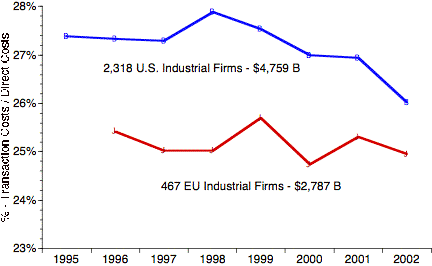

> Management thinking needs to move away from focusing on IT expenses
> to dealing with total transaction costs.

As organisations get ready to make financial commitments for next
year, executives are questioning whether they should continue to spend
more on IT. Many have already voted with their feet, for after 50
years of steady growth IT spending has levelled off with few prospects
of a pick up soon.

Boards of directors are debating whether they should cut expenditure and fund new investments 
from savings obtained from cheaper technologies. They are considering if they should decrease 
money for IT innovation because vendors are preparing to make new solutions available. They 
may even be preparing to opt out of the technology race all together by outsourcing IT staff and 
remaining on the sidelines until the risks become more manageable.

Executives are flooded with reports and articles offering advice on what to do with IT. The 
prevailing view nowadays is that IT will remain stagnant for a while. Meanwhile vendors and 
computer magazine editors advocate investing to keep up with the competition. A company's 
approach to the next budget cycle will depend on which of these opposite views it takes. The 
purpose of this article - the first in a series - is to offer insights on how to set a course that will 
get maximum value from IT.

An article by Nicholas Carr in the May 2003 issue of the Harvard Business Review resulted in a 
lively debate about its claim that IT spending will level off permanently because IT has become 
strategically irrelevant. The author proposed the following policies:

* Cut IT budgets
* Do not invest in information-technology innovations
* Invest only after others have succeeded - follow rather than lead
* Delay IT investments because prices are dropping and everything will be less 
epensive later
* Refocus from seeking opportunities to managing vulnerabilities and risks
* Disregard vendors' innovative offerings because they are suspect for seeking added 
revenues
* Delay innovation as the preferred way for cutting IT costs.

Most of the article is based on analogies with the adoption of steam engines, railroads, 
telephones, electric generators and motors. Each of these technologies experienced a spurt in 
growth only to be topped off when diminishing returns set in. Therefore, IT stagnation is a 
perfectly predictable phenomenon. Nobody can be blamed for it since it is as natural a process as 
ageing.

Such logic is defective because it treats IT as if it were an industrial age capital-intensive physical 
good **(1)**. From a budgeting standpoint the capital component of IT spending is less than 15% of 
total IT expenditure. Even this small share is decreasing with shrinking costs of computing 
equipment.

Information is not subject to diminishing returns. The marginal cost of information goods - 
especially of software that now takes the dominant share of information technology costs - does 
not rise with increased scale. If transactions grow the unit costs decrease rapidly to zero variable 
cost. 

If diminishing returns, technological maturity or competitive irrelevancy cannot explain the current 
slowdown in spending what then is the reason? The answer is that the current malady is 
managerial not technological. We have now come to recognise that there is a basic flaw in the 
ways that IT is planned, acquired and then managed. Executives must accept that spending on IT 
involves decisions that influence how an organisation functions and how it competes.

Such decisions should not be passed on to staff, consultants or vendors. What we are facing now 
is not stagnation but a period of re-appraisal in management thinking from focusing on IT (a mere 
3.5% of revenues) to dealing with total transaction costs (over 19% of revenue). The difference 
between IT costs and transaction costs is information labour. Only labour can be productive - not 
computers.

### Transaction Ratio Analysis

The evidence for shifting the diagnosis of the current slump from rising technology costs to the 
economics of transaction costs can be gathered from the financial data of listed corporations. 
Figure 1 shows the ratio of transaction costs to direct costs for the period from 1995 to 2002. **(2)**
Transaction costs are defined here as the expenses for the information necessary to organise a 
firm's capacity to produce and deliver goods and services to customers. This expense is reported 
in accounting statements as sales general administrative research and development costs.

US industrial firms spend on average 27% of total transaction costs on IT and EU firms average 
25% **(3)**. However, this amount must be viewed as an investment and not as an expense. As any 
investment it must produce measurable gains. For IT investments this must first show up as a 
decline in transaction costs. The numbers tell us that this not the case for EU between 1995 and 
2002.  The 2002 decline in the US reflects sharp staff reductions to cope with an economic 
recession.  It remains to be seen if such improvement will be permanent.

Figure 1: Little change in the ratio
of transaction costs to direct costs for the period from 1996 to 2002
for the EU

&nbsp;

Different characteristics can be observed for financial services firms (See Figure 2). Transaction 
costs are reported here as administrative and general expenses.  The direct costs are total costs 
for services less transaction costs. **(4)**. Despite rising budgets in the financial and services sector, 
which makes up the most computer-intensive sector of the economy, no gains in the costs of 
managing the business have shown up yet.  During the current recession the high fixed overhead 
costs, especially in banking and insurance, have increased the relative importance of transaction 
costs.

Figure 2: Despite rising budgets in the financial and services sector no declines in the 
costs of managing the business have shown up yet 

&nbsp;

### The Challenge

From 1980 until 2000 the typical IT budget grew about 12.5% per year. The performance of 
information technologies also kept improving at least 15%. For every $100 dollars of IT spending 
in 1980 a CIO could end up with a staggering $16,433 worth of 1980 computing power **(5)**. No 
wonder that the dominant characteristic of all spending was waste.

Why were organisations unable to take advantage of IT capabilities?
The explanation is simple.  Each firm had to organise its IT
department, train its managers, educate its executives, develop most
of its software and integrate vendor offerings with disorderly legacy
code. It was easier to junk and re-build instead of to accumulate and
grow. Vendors and consultants thrived with revenues growing faster
than IT budgets. Out of total 2002 worldwide IT spending of $2
trillion the vendors and consultants reaped about 30%.

Financial executives are now asking where they can find the gains from IT spending. They are 
not looking for a small amount of money. For US manufacturing firms IT investments accounted 
for over a third of all new capital expenditures. For the US financial and services sector the IT 
investments consumed most of the capital used for acquiring non-financial assets.

Where are the reductions in transaction costs that accrue from the widely advertised boasts of the 
18% compound annual reductions in computer technology costs? The answer is to let the 
vendors not the IT department, deliver services that reflect the rapidly dropping costs of IT. 

Since average annual software investments equal about a tenth of total transaction costs how 
can we achieve reductions in expenses for knowledge and administrative payrolls? The answer is 
to simplify business processes and weed out redundant workflows. The target here - especially in 
the public sector - is the bureaucracy that will always oppose gains in productivity through 
computerisation. 

How can we now gain benefit from IT department annual budget increases that exceeded both 
revenue and profit growth for more than a decade? The answer is to alter the budget process 
from focusing on IT to an examination of total transaction costs.

We are at the end of an era in which the objective was to acquire as many IT resources as 
possible. From now we will have to squeeze as much value out of IT budgets as restructuring in 
IT spending will allow.

First, we must get the IT department to start tracking the rapidly dropping prices of the vendors. 
This can be done best by rethinking how money is spent. The current allocations to hardware 
software and services will have to shift because asking for substantial additional funds will be 
unacceptable. Moving to application services isr the solution because vendors will then have to 
assume the risks of technology obsolescence.

Second, we must cease thinking about information as something that is limited to IT. The winners 
of the global competition for markets will be organisations with the lowest and most responsive 
transaction-handling capabilities.  

Getting both missions accomplished is only for the swift not the sluggish. 

# Action points

* Spending growth has levelled off and will not pick up soon
* Stagnation is not caused by technology maturity or saturation
* The current reluctance to spend is because transaction costs did not fall in most 
cases
* Restructuring of IT budgets will enable organisations to move technology risk to 
vendors
* Executives must focus on transaction costs, not on IT.

___

#### Footnotes

1. [http://www.strassmann.com/pubs/hbr/carr-letter.shtml](../hbr/carr-letter.shtml), or 
[http://harvardbusinessonline.hbsp.harvard.edu/b01/en/files/misc/Web_Letters.pdf](../hbr/Web_Letters.pdf)

1. Compustat Global Database, 06/12/2002 with only partial results for FY 2002.  A complete set of financial 
data for 2002 will be available early in 2004.  Our analysis covers financial results for $9.6 trillion of 
revenues, which accounts for about 65% of total spending of listed firms with contiguous history since 1996.

1. The median IT/revenue ratio for US firms is 3.5%. The average SG&A/Revenue ratio for US firms is 19%.

1.  US financial and services firms spend 46% of total expenses on transaction costs. In almost all cases the 
IT department is the single largest cost centre. The IT budgets in the financial & services sector amount to 
20% of total US IT spending.
1. $100 compounded at a 27.5% interest rate over 21 years will produce this number.

