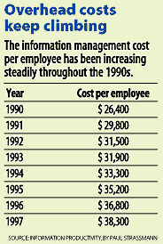

There's good news and bad news in Paul Strassmann's forthcoming book,
Information Productivity. The good news is that during the past 10
years, U.S. industrial corporations have lowered the ratio of
information management costs to operating profits and net assets. The
bad news is that the country's largest companies fall far short of
using technology to maximize profits.

{: .callout}

Strassmann, former CIO at General Foods and Kraft, is a consultant who
specializes in measuring the effectiveness (or ineffectiveness) of
information management. His book is based on his analysis of financial
disclosures by 10,593 publicly traded industrial corporations. Private
companies are not included. Also missing are banking, insurance, real
estate, and medical services enterprises because their financial
structure is materially different from that of industrial companies.

It's difficult to disagree with Strassmann's conclusions because
they're so data intensive, but it's also difficult to totally agree
with them because numbers alone don't convey a complete picture. As
columnist Bob Lewis wrote of Strassmann's previous book, *The
Squandered Computer*, "... collecting facts and drawing proper
inferences are two different matters." (See "[For a clearer picture of
its value, get to know those who use the equipment](https://web.archive.org/web/20000411105431/http://www.infoworld.com/cgi-bin/displayNew.pl?/lewis/980126rl.htm).")

Our research expert, Senior Associate Editor Jim Battey, points out
that "information management" is not the same as IT
management. Strassmann defines information management expenses as the
sum of sales, general, and administrative, plus research and
development expenses -- commonly known as overhead costs.

The fact that the amount spent on information management keeps rising,
Strassmann contends, is bad because as fixed costs increase, the
break-even level for business operations increases with it.

By Strassmann's calculations, 55 percent of the U.S. workforce is
employed in occupations that are almost exclusively engaged in
information processing, coordination, creation, and distribution --
all of which add up to the information economy.

As a result, Strassmann says, "the effectiveness in deploying
information resources has potentially a greater effect on corporate
financial performance than any other economic influence. That is
because corporate executives have greater discretion in directing what
their information management staffs will do than in setting the terms
for materials purchase, employee compensation, taxes, or interest
rates."

And corporate executives are doing a bad job of managing information
resources, he says. During the 1990s, the cumulative increase in the
information management cost per employee was 57.9 percent, compared
with gains in employee wages and salaries of only 40.5 percent.

The culprits, Strassmann claims, are big companies. A mere 108
companies that employ more than 50,000 people account for nearly 43
percent of the $1.05 trillion spent on information management. By
contrast, 1,040 companies with 5,000 to 10,000 employees spend a total
of $96 million, or about 9 percent.

According to Strassmann's Web site (www.strassmann.com), *Information
Productivity* is scheduled to be released in June, 1999. The listed
pre-publication price is $69, plus shipping and handling.

> Editor in Chief Sandy Reed has been following the high-tech industry
> as a journalist for 15 years. Send comments to
> sandy_reed@infoworld.com.
