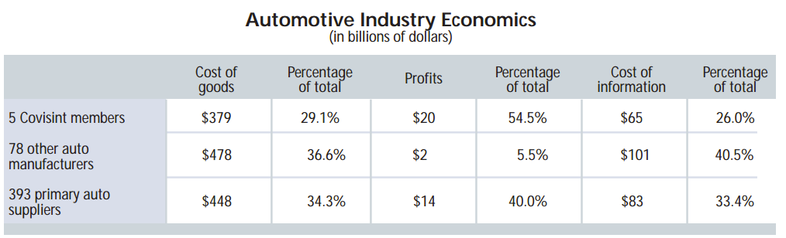

Also available as a [pdf](11-2000.pdf)

> Oligopsonies in B2B exchanges are likely to inhibit corporate gains in knowledge

This year a new topic has occupied magazines, business meetings and
executive conferences. Business-to-business (B2B) electronic commerce
is heralded as the next great opportunity for increasing profits,
enhancing productivity and reaping "new economy" gains from the Internet. Desire for this bonanza has produced a flock
of start-up companies and purchasing consortia, all professing to have
discovered a way to create instant wealth.

Fulfillment of these promises depends on the ability to solicit
real-time bids for goods and services on a global basis and pare
suppliers' prices to the minimum. B2B schemes also promise enormous
reductions in global administrative costs through automation of the
steps in acquiring goods and services from otherwise
difficult-to-reach sources. Now the time has come to examine how this
hoopla anticipates changes that may influence knowledge management.

B2B trade has ancient origins. For centuries caravans on the Silk Road
carried a steady supply of merchandise from China to Mediterranean
merchants. Dozens of land-based intermediaries prospered by passing
commerce from one trader to another. During each transfer of goods,
their price increased; thus scarcity of supply and perilous logistics
favored the creation of oligopolies, in which a few sellers controlled
markets. For these reasons, much of commercial history can be
understood best by studying competitive forces, such as when one
monopolistic supplier assails the power of another. For instance, to
cut off the Venetians and the Genovese from their mideastern sources,
the Portuguese and the Dutch embarked on sea voyages around Africa
that eliminated most of the land-based traffic.

What B2B is trying to accomplish today is not much different. It
offers a new means of gaining direct access to sources of supply and
of cutting out wholesalers, distributors, export agents, subassembly
aggregators and component integrators. It reflects a shift of economic
power over pricing from many business suppliers to relatively few
business customers.

What's different is that the world has developed a surplus of
manufactured supplies at the same time that market-limited commercial
demand has become concentrated in a handful of
U.S. corporations. Instead of supply oligopolies (of few sellers and
many buyers), B2B is propelling commerce toward demand oligopsonies of
few buyers and many sellers.

## In the driver's seat

The economics of global automobile manufacturing illustrate the
characteristics of an emerging oligopsony. The B2B purchasing
consortium in this industry is Covisint, which was organized earlier
this year and is operated jointly by Daimler/Chrysler, Ford, General
Motors, Nissan and Renault (other car makers have declared their
intentions to join it). The stated purpose of this exchange is "to
create visibility within a company's supply chain [by] transforming
the linear chain into an efficient networked model." Its Web site
declares that Covisint "is not about incremental improvement [but] is
a fundamental redesign of the enterprise." The upshot is that
standardized Covisint processes would take over a large share of
existing procurement processes, which usually account for about half
of any automobile manufacturer's economic added value.

The table "Automotive Industry Economics" summarizes data from
publicly listed global corporations classified as manufacturers of car
bodies or vehicle components according to the Standard Industrial
Classification. Examination of this data suggests three conclusions:

Firstly, the Covisint firms reap over half of all of the available
industry profits while keeping their cost of information low relative
to their cost of goods. According to my metric of knowledge capital
accumulation efficiency (the ratio of cumulative gains in knowledge
capital compared with the cumulative expenses for all information such
as marketing, sales, administration, computers and software [see
"Accumulating Knowledge Efficiency," February 2000 *KMM*]), this
means increased purchasing power for Covisint. Such efficiency will
enable it to impose terms emphatically on their suppliers, in a way
that economically weaker competitors cannot. Covisint not only is
efficient in its use of information resources (expressed in the ratio
of profits to information costs) but also has the potential to keep
enhancing this advantage by having more profits to expend in competing
for sources of supply.

Secondly, although the other auto manufacturers spend more money than
the Covisint Five on information (which includes all spending on
knowledge management), their ability to extract pricing concessions
from their suppliers (who account for about half of their cost of
goods) will diminish as Covisint's power grows. This will increase the
pressure on them to join the exchange; as a consequence they will
reduce their spending on knowledge management.

As shown in the table above, the profits of the auto manufacturers not
participating in Covisint are already squeezed to very low levels, and
the efficiencies of B2B procurement will lower the prices of
automobiles for consumers. The only option available to those 78 auto
manufacturers will be to keep cutting their information costs. The
payoff for knowledge accumulation will appear in the transaction
prices at which B2B supplies are purchased. Therefore, the auto
manufacturers will have less incentive to spend money on knowledge
management that concerns the production pipeline -- which is where
they spend most of their KM dollars now.

As the automobile manufacturers' oligopsony reduces their profits, the
393 primary auto suppliers will not be able to sustain high-level
spending on information management. This will produce ripple effects
on the secondary tier of suppliers (more than 2,000 major companies),
who likewise will reduce their levels of information spending. (It
seems certain that Covisint's imposing new database and communications
protocols will force everyone to spend more on IT, but this is another
matter.)

The implications of this B2B development for management are
significant. I have examined the economic structures of large B2B
purchasing consortia in other industries, including Exostar (made up
of four aircraft manufacturers that account for 62 percent of that
industry's global profits), ForestExpress (three dominant forest
products companies) and Pantellos (17 U.S. energy utilities). So far,
their profit and cost profiles suggest that the concentration of
economic power in B2B offerings will follow similar patterns to those
outlined in the case of Covisint.

However, over 900 entrants are rushing to participate in the alleged
B2B boom. For instance, Elemica (the purchasing consortium of some
dominant chemical manufacturers) is confronted with at least five B2B
start-ups claiming to offer similar services. Obviously, this
oversaturation cannot continue. Therefore, as knowledge managers
become increasingly involved in decisions concerning which B2B
alliances to pursue, they should carefully assess which candidate has
the best prospect for accumulating knowledge capital that will help it
to survive when most of the other B2B ventures disappear.

