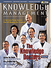

Back to main article: [*The Importance of Knowledge Capital*](importance.html)

> Despite claims to the contrary, ownership of Knowledge Capital is highly concentrated

These findings reveal a gulf in the knowledge economy:

* The top 100 firms among the 7,288 accumulated $5.6 trillion of
  Knowledge Capital of the total of $6.4 trillion or 88 percent of the
  total. These were all giant firms. This imbalance contradicts the
  popular theory that small firms account for the creation of new
  Knowledge Capital in the new economy. In fact, the large still rule
  wherever we look.

* There were 3,917 firms (almost 54 percent of the total) whose
  Knowledge Capital was negative. In other words, they were worth less
  than their accounting valuations and worth more on paper than if they
  were auctioned off at "book value." The sum of their negative
  Knowledge Capital was $2.0 trillion or 36 percent of the worth of the
  top 100 Knowledge Capital creators. This condition offers a strong
  argument against the proposition that the U.S. economy -- during a
  period of unprecedented prosperity -- may be approaching its
  capacity to generate wealth. Over half of the listed corporations
  appear to be searching for the bonanza of the new economy without
  finding it.

* Translating these statistics into human terms, we discover
  enormous waste. The 3,917 firms with negative Knowledge Capital
  employed a total of 10.8 million persons or roughly 30 percent of the
  total number of employees in our sample. The average losing firm
  employed 2,757 people, and each of them was a liability, contributing
  negative Economic Value Added to the economy.

* Contrast the Knowledge Capital poverty of the losers with that
  of the top 100 Knowledge Capital creators. Those firms employed 7.3
  million persons or an average staff of 73,000. The Knowledge Capital
  per employee was worth $774,400. Each employee was a source of wealth
  in excess of the worth of his or her compensation.  

