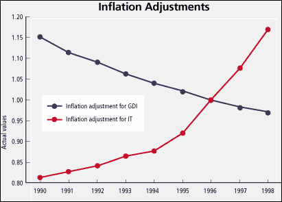

> Take a closer look at numbers touting the value of the IT industry,
> especially if they come from the federal government.

Because it isn't easy to quantify, knowledge management is vulnerable
to a high level of uncertainty among executives as to its
impacts. Therefore, distortions in the metrics we apply to KM could
significantly influence its acceptance. That's part of why KM metrics
are a continuing focus of this magazine.

One danger we must keep in mind is the tendency to equate KM with
information technology. Reducing the complex, ongoing process of
knowledge management to simply buying computers risks alienating
business leaders when they don't get the benefits of KM from plugging
in their new purchases.

Perhaps the most often mentioned example of this disparity is the
so-called "productivity paradox," which wryly states that computers
can be seen everywhere except in the productivity statistics. Hundreds
of articles and several books have been written about this conundrum,
yet most academics have concluded that the paradox is an illusion
because we cannot measure the benefits that computerization actually
delivers.

To get around this barrier, consultants and IT managers who seek
bigger budgets for computerization often resort to what I call bending
the numbers. Numbers are "bent" when one mixes real numbers with
measures that either are not verifiable (see my column "Intelligence
in Question," October 2000 <I>KMM)</I> or are numerically precise but
irrelevant.

It is difficult to expose the practice of number bending because the
principal culprits--such as prognosticators cited by journalists as
authoritative sources--don't reveal the details of how they arrive at
their projections. For instance, the pundits never backed up their
widely quoted forecasts that the Y2K disaster would cost organizations
anywhere from $600 billion to $1.5 trillion. The actual cost ended up
being about $150 billion.

As another egregious example, five of the most prominent market
forecasters have predicted prospects for electronic commerce. Their
estimates for e-commerce spending in 2000 ranged from $185 billion to
$3.1 trillion; their projections for 2003 range from $1.26 trillion to
$9.9 trillion. The differences are so great because these well-paid
gurus have bent the numbers while interpreting inaccurate statistics
about e-commerce.  

Perhaps you're not surprised to hear that market analysts fudge
numbers to inflate their own reputations. It's not so easy for
government agencies to do that, as they are required to disclose the
rationales for their analyses and the sources of their data. Number
bending still occurs, but in most cases it can be quickly
discovered. For example, the most recent statistics published by the
U.S. Department of Commerce about the contributions of information to
growth in the U.S. economy offer an excellent opportunity to study how
to examine published metrics critically. I picked this case because it
is widely used to support claims that we have entered the era of a
knowledge-based economy.

In 1998 the Department of Commerce reported that computer-based
information industries had driven more than one-fourth of America's
total real economic growth. A follow-up report in 1999 stated that the
IT sector had fueled 35 percent of the nation's real economic
growth. Timed to coincide with an electoral campaign that presented
the Clinton-Gore administration as a promoter of high technology, a
revised report last year stated that information industries
contributed nearly a third of the real growth of the U.S. economy.

Looking into these numbers, we find that the claim that information
accounts for such an enormous contribution is supported by bending the
relevant numbers in a couple of ways. First, the government broadens
the definition of the "information revolution" as far as possible,
including in it radio and television broadcasting, office machines
such as photocopiers and faxes, laboratory analysis equipment,
manufacturing testing instruments, household audio and video
equipment, wired telecommunications carriers, paging equipment,
cellular communications and just about everything else that is
electronic. Second, the government places information technology in
the most favorable perspective by applying inflationary or
deflationary "adjustments" to the actual numbers involved. The output
of all other sectors of the economy is reduced, while the contribution
of information-based industries is heightened. Much of such boosting
is based on the presumption that lower prices of personal computers
and increased densities of magnetic storage media somehow translate
into economic effectiveness. This manipulation is shown in the figure
"Inflation Adjustments."

In the graph, $1.15 worth of gross domestic income (GDI) in 1990 was
worth only 98 cents in 1998. In contrast, 81 cents worth of
information technology in 1990 was worth $1.18 by 1998. By depressing
the contributions of the rest of the economy and jacking up those of
information products, it is possible to magnify the contributions of
IT-producing industries to economic growth to yield a numerically
precise 31.9 percent increase.

No one would dispute that an enormous amount of money has been spent
recently on various initiatives connected with computers, including
the sums wasted on Y2K fixes. The willingness of corporations to throw
money at all kinds of Internet projects resembles in many ways an arms
race. In my own calculations--based on cash and not on bent
numbers--the contributions of IT-producing industries to economic
growth turn out to be a still respectable but more credible 9 percent.

KM proponents need to think critically when examining industry metrics
and must learn how to recognize bent numbers. The boosters of immodest
claims and inflated metrics will continue to proliferate, prosper and
perhaps even undermine KM projects until a better understanding
emerges of the contributions it can make. Knowledge management is a
good idea in its own right, and exaggeration will only devalue it.

> Paul A. Strassmann originated the trademarked concepts "information
> productivity", "return-on-management" and "knowledge capital."
