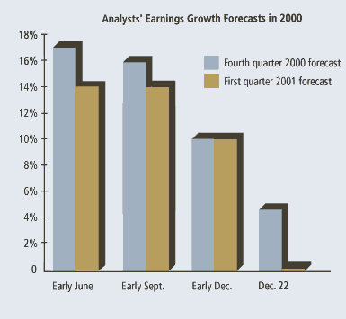

> Using analysts' earning forecasts to estimate the worth of
> intellectual capital is misleading.

As I have noted before, the proliferation of articles about the value
of knowledge is propelled by the stratospheric stock-market valuations
of high-technology start-ups. Even though the profits of these
dot-coms may be negligible or nonexistent, attributing their stock
appreciation to a new financial artifact -- conveniently labeled
"intellectual capital" -- enables many analysts to rationalize their
otherwise fantastic valuations. By discounting projected earnings into
the distant future, anyone could come up with a calculation to justify
any quoted stock price, no matter how unrealistic.

Last May, when the market valuations of technology stocks were at
their peak, I discussed my own approaches to the valuation of
knowledge capital at a two-day conference in Washington, D.C. The
audience included many prominent advocates of the "new economy."
Their leading spokesman (a successful investor in risky IPOs and a
frequent keynoter at global conferences about the information age)
opined that my method for calculating knowledge capital is
wrong. Since I recognized only historical -- not potential -- earnings, he
concluded that I would advise the audience to sell their holdings in
such companies as Microsoft Corp., Cisco Systems Inc., Amazon.com or
Xerox Corp. My response was that valuations that project up to 50
years of continued growth in earnings were fantasies unworthy of a
prudent investor. 

In this case, my conservative views were in clear contrast with the
position taken by Baruch Lev, a professor at New York University, who
explained to the same audience that knowledge capital valuations
"must recognize a company's full stream of expected future earnings
... discounted to determine the present value of the company's
intangibles."

By the way, I agree with Lev on many fundamentals (as noted in 
"[In Search of Knowledge Capital](valuation.html),"
September 1999 *KMM*) other than
relying on future earnings estimates. He published an influential list
of intellectual capital valuations of 90 leading U.S. corporations in
the financial weekly *Barron's* (November 20, 2000). To create
earnings forecasts, Lev says he "used analysts' consensus estimates
of companies' long-term growth rates to come up with the first five
years of expected earnings." Using other approximations and discount
factors, he then projected the future earnings for another six years,
at a declining rate of growth. Attempting to peer 11 years into the
future makes little sense if the record shows that the financial
analysts' predictions are materially in error in less than six
months.

Since many <I>KMM</I> readers may be confronted by the intellectual
capital valuations from <I>Barron's,</I> it may be helpful to
understand the flimsy foundation on which stock- market analysts'
projections are based. On December 26, 2000, <I>The New York Times</I>
featured a summary comparison of predictions, as shown in the chart
"Analysts' Earnings Growth Forecasts in 2000." 

According to the chart, in only four months (from early September to
late December) the analysts' visions of the future dropped sharply
from more than 16 percent growth to only about 5 percent for the
current financial quarter (the last quarter of 2000) and from an
optimistic 14 percent growth to almost nothing for just one quarter
ahead (the first quarter of this year). This decline in confidence
should make proponents of knowledge management projects think twice
about using such estimates as a basis for explaining the worth of
their projects to leaders of their company.

Of course, this is not to imply that knowledge capital is not
valuable. It is a demonstrable fact that the worth of most
corporations is not reflected in their accounting ("book")
valuations. And it is now widely acknowledged that assets considered
"intangible" by auditors determine most of the earning capacity of a
company. Rather, the point is that most of what has been written to
date about such intangibles has been described in qualitative terms
often bordering on puffery (see "[Intelligence in Question](intelligence-q.html),"
October 2000 *KMM*). 

Lev's work in this field is the most thoughtful attempt I have seen to
 come up with a method that would make it possible to quantify the 
dollar worth of knowledge capital. Unfortunately, an approach like 
his could backfire when you are trying to convince executives to
 make investments in knowledge capital formation. Seeing the 
stock-market analysts' faulty prognostications included in the
justification of a budget for knowledge management, any shrewd executive
 would decide it was wiser to give priority to public relations, 
advertising or manipulation of the accounting numbers than to 
investments in people.

