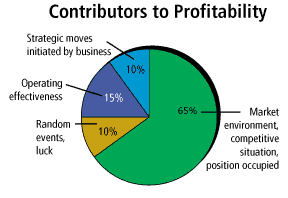

> Sound business strategies, not information technology, create valuable assets

In addition to intellectual capital, knowledge capital and intangible
assets, you may soon need to understand how to value and build on the
"organizational capital" in your corporation. According to *The
Economist* (Nov. 11, 2000), MIT professor Eric Brynjolfsson has a
new theory of how to rationalize spending on computers, in which
hardware and software aren't the only forms of IT that add
value. Spending on them actually accounts for only 10 percent of the
total typical corporate budget for information systems, which itself
amounts to only about one-tenth of average corporate costs for labor
and materials. Brynjolfsson claims that U.S. corporations have created
$1.5 trillion of organizational capital recently by making new
investments in business processes, products and employee training -- all
of them enabled by computers.  

What we have here is a suggestion that we stop searching for economic
payoffs directly related to investments in computers (which is a
dubious proposition anyway). Rather, it proposes seeking the
justification for more spending in benefits achieved
elsewhere. Proponents of IT expansion, the theory goes, should now
look for profits in the generation of organizational capital to
justify high levels of spending.  

This notion of organizational capital has implications for the
willingness of corporations to deploy knowledge management
programs. Icons of computerized sophistication and best practices in
knowledge management such as Motorola and Xerox have seen their
financial fortunes fall precipitously. Both companies have in the past
publicized their investments in business processes, products and
employee training. Why then are they in such trouble?  

Let's look into what really determines profitability. The soundest
evidence can be found in the results of research on the profit impact
of market strategies (PIMS). For more than 20 years practitioners of
this discipline have been gathering and analyzing data. PIMS findings
represent comprehensive, credible insights about the influences on
financial results. The chart "Contributors to Profitability"
summarizes findings about the sources of differences in financial
performance among competitors.

The implications of PIMS conclusions on the practice of knowledge
management are far-reaching. Knowledge about a company's business
environment and its competitive position are the most valuable
insights for executive management; 65 percent of the profit
performance of corporations can be attributed to them. The primary
task for knowledge management is to collect and assemble relevant
intelligence about these strategic areas.  

Yet the consumers of corporate intelligence are only a handful of
decision-makers, and producing it typically consumes only a small
fraction of a company's total spending on information. I personally
observed that the failure of Xerox to take advantage of its
technological and intellectual superiority was due primarily to
mis-managed collecting of unbiased information about customer
preferences.  

On the other hand, operating efficiency in the form of low overhead
costs, effective business processes and employee awareness helps to
create value -- but not as much as intelligence does, and it is
certainly not the decisive factor, affecting only 15 percent of profit
results. Most consumers of this kind of knowledge are employees, and
instituting programs to reach them is very costly. Neither networked
sharing of knowledge nor workflow enhancements did anything to brake
Xerox's recent skid to the verge of bankruptcy.  

Professionals in knowledge management should be careful not to become
identified as refurbished IT people. Linking computerization too
closely with the capacity to create organizational capital -- or any
other such trend -- can damage careers when such opportunism goes out of
fashion.  

The objective of knowledge management should be to increase the
non-financial worth of organizations. This requires a thorough
understanding of why organizations succeed or fail. Though the PIMS
conclusions noted above are generalized, the correction of any
knowledge deficiency is always specific to a company and a
situation. Careful analysis should precede any purchase of software.

In short, IT does not create organizational capital. Only
well-conceived strategies that are well-executed can accomplish that.

> Paul A. Strassmann originated the trademarked concepts "information
> productivity", "return-on-management" and "knowledge capital."
