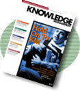
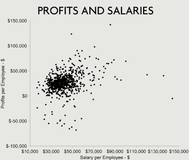
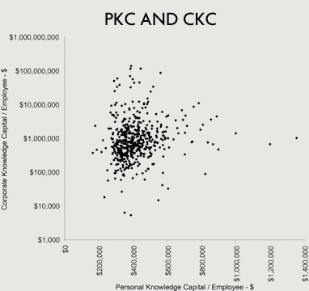

> Personal knowledge capital is a valuable intangible asset, but most companies don't exploit it.

In our knowledge-based economy, there are many kinds of capital:
organizational, intellectual, knowledge, human, structural, customer
and innovation capital are all recognized concepts. However, at least
one source of capital in an organization's intangible assets has not
been clearly identified. I call it personal knowledge capital.

My own work on quantifying knowledge capital (KC) has been based on
the assumption that a knowledge-based asset is the residual worth left
after a business deducts expected returns on financial capital. But
this approach does not address the intrinsic worth of employees. After
all, even employees of a firm that has no knowledge capital possess KC
of their own that they can market to other employers. In trying to
recognize the worth of individuals--as opposed to the worth of
corporations--I have distinguished two manifestations of knowledge
capital.

Personal knowledge capital (PKC) is directly related to the total
compensation a knowledge worker can obtain in the marketplace. We can
calculate the relationship between an individual's PKC and salary on
the assumption that employers "rent" a person's PKC. This approach
discards classical theories about wages and sees individuals
themselves as capitalists. The worth of someone's PKC is their annual
salary divided by an interest rate that reflects the implied cost of
capital.

The "knowledge interest rate" will vary with the overall
economy. Yearly salaries can be seen as analogous to the worth of an
annual bond coupon. Once you know the price of the coupon, you can
find the nominal worth of the bond. For example, if labor markets are
tight and a new employee represents a risky investment, the "coupon
rate" for purchasing knowledge would be equivalent to a bond rated B
or C. Thus, at 15 percent the PKC of an employee earning $40,000 per
year would be $266,666 ($40,000 divided by .15). If the labor market
is short on talent and employees need time to develop corporate
know-how, however, the coupon rate for acquiring knowledge would be
equivalent to a bond rated AA or A. In that case, at 6.5 percent the
same employee's PKC would be worth $615,384 ($40,000 divided by
.065).

In contrast, corporate knowledge capital (CKC) is reflected in the
worth of corporate earnings to shareholders. We can value CKC by
subtracting the worth of the company's PKC. This measure I discussed
in detail in "[Calculating Knowledge Capital](calc-km.html)" 
(October 1999 *KMM*).

The concepts of PKC and CKC are not merely theoretical. They lead to
insights into the economic role of corporate knowledge. To illustrate
this use, I collected 1999 financial results for 726 U.S. banks in the
graph 

The results show no relation between a bank's
average employee salaries and its corporate profits. If salaries
reflect employees' market worth, the scatter graph tells us that the
corporate values of knowledge capital cannot reflect that worth. For
instance, the graph shows a number of banks paying employees an
average salary of $50,000. Yet the profits per employee for these
banks range from negative $70,000 per employee to positive $130,000
per employee. Such disparities demonstrate that corporate results and
employee worth (as measured by compensation) are unrelated.

Plotting the relationship between personal and corporate knowledge
capital per employee can make such a comparison explicit. The graph

shows that the employees' KC is not reflected in
corporate knowledge. To calculate the average worth of the banking
workforce in 1999, I used the average knowledge interest rate of 10
percent. These results show an even greater disparity than the
others. For instance, an employee with $400,000 of PKC might be
working for a bank with CKC anywhere from $5,000 to over $100
million per employee.

In many banks, PKC exceeds CKC, which suggests that either the bank
cannot afford to "rent" (pay the salaries of) its employees or the
employees will find it more rewarding to move to another bank that
generates a surplus. In such surroundings, employees often will end up
depreciating their PKC and ultimately lowering their market worth.

The converse argument is also true. In banks where PKC worth $100,000
is supporting CKC of $100 million, employees ought to use every
opportunity to enrich themselves by acquiring more knowledge. This
condition would call for adopting policies that would result in
knowledge appreciation.

But the most important finding is that there is absolutely no
correlation between how banks value the worth of their employees'
knowledge and how well those banks perform in the marketplace. Similar
comparisons for other industries all display identical
characteristics.

Whenever executives propose to invest in knowledge management to
enhance the worth of their workforce, first they ought to examine
their positive or negative valuations of PKC and CKC. When employees
are overvalued, which means that the CKC/PKC ratio is low, it would
pay a bank to leverage employees' intrinsic capabilities. Employee
knowledge enhancement should take top priority. If the opposite is the
case, employee retention becomes important. Next month we'll consider
how that translates into action.

> Paul A. Strassmann originated the trademarked concepts "information
> productivity", "return-on-management" and "knowledge capital."
