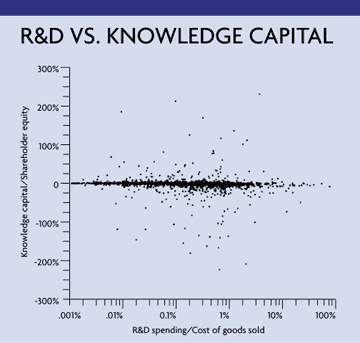

> Analysis of data shows an uncertain relationship between knowledge
> capital and research and development.

These days, "knowledge" is a popular term for justifying increased
spending on technology tools. But beyond anecdotal explanations, I
have seen no hard evidence to demonstrate that spending more money on
KM programs, devices and solutions would improve a company's financial
results. 

When pressed for proof of profitability, proponents of knowledge
development programs respond that hard data is difficult to obtain. In
the absence of generally accepted metrics or even a theoretical model,
some of these experts resort to techniques of the sort used in food
testing, beauty contests and opinion polls. They produce conceptual
presentations, logic diagrams, pie charts and bar graphs, but nothing
that a skeptical investor with limited funds would consider to be
verifiable justification.

In the presence of such an analytical vacuum, I am amazed that so
little attention is paid to a knowledge acquisition activity for which
data is widely available, whose results can be traced for more than a
decade and whose individual data points possess as much reliability as
our corporate institutions are capable of producing. I am referring to
annual data for research and development expenditures, which appear
regularly as line items on audited financial statements.

The accounting practices for identifying these expenditures are well
established and regulated by the Financial Accounting Standards
Board. Reporting of R&D expenditures is scrutinized by government
agencies, including the Securities and Exchange Commission and the
Internal Revenue Service, that have power to enforce credibility in
what is reported. The history of granting investment tax credits for
R&D also contributes to the consistency of such data over an extended
time. 

To demonstrate the reliability of this source of data, I will use the
1999 R&D expenditures for 2,004 U.S. corporations, as reported by
Standard & Poor's, to test the proposition that more R&D increases
knowledge capital (KC). The companies' annual financial statements
offer insights into the rewards of organized knowledge gathering in
R&D departments that are usually under seasoned professional
management.  

### The Right Ratio

For purposes of this article, I have chosen to examine the
relationship between the ratio of R&D spending to cost of goods
(R&D/COG) and the ratio of knowledge capital to shareholder equity
(KC/EQ). The R&D/COG ratio should tell us how many cents of deliberate
spending on enhancing a corporation's knowledge are embedded in every
dollar's worth of goods produced. The KC/EQ ratio should tell us
whether the worth of knowledge capital exceeds the nominal worth of
financial capital (also called a company's book value).

Over the past year in this column, I have described how to measure
knowledge capital; you can find these articles at [Knowledge Management
Magazine](../../articles.html?t=KM) or 
[www.destinationKM.com](http://www.destinationKM.com).

However, for this particular analysis I have
applied a more rigorous approach to calculating the effective cost of
capital by using the capital asset pricing model, a method widely used
in financial portfolio analysis to determine the expected rate of
return on an investment at a specified level of risk. The capital
asset pricing estimates are currently listed in Standard and Poor's
Compustat tables. 

I used this method in this case because the reported R&D numbers are
sufficiently accurate to attribute company-specific internal risks to
their R&D investments. For my usual knowledge capital calculations,
that is not possible because there we deal largely with external and
strategic risks.

A comparison between R&D/COG and KC/EQ ratios does not suggest that
corporations that spend more on R&D will improve their ratio of
knowledge capital, as the graph "R&D vs. Knowledge Capital" shows. In
other words, knowledge accumulation through R&D expenditures is only a
contributory influence on corporate performance as a creator of
knowledge capital -- not a decisive influence.  

The graph demonstrates that as R&D/COG -- the ratio of R&D spending
compared with the cost of goods sold -- increases from a negligible
amount of 0.001 percent for an agricultural products company to a high
of 100 percent for a biochemistry start-up, the gains in knowledge
capital relative to shareholder equity do not show a favorable
trend. Put simply, more spending on research and development (a
knowledge acquisition investment) does not show up as gains in
knowledge capital.

The random pattern in the scatter graph also appears in all of my
prior studies dealing with knowledge enhancement efforts, such as
spending on computer systems. Yet random patterns do not invalidate
the need to spend money on knowledge management, on R&D or on
computers. Rather we should understand the absence of correlation
between spending and knowledge acquisition primarily as a warning that
unless sound business practices, superior management and advantageous
competitive positioning are also present, spending on even the most
worthy of endeavors will not necessarily produce superior results.

> Paul A. Strassmann originated the trademarked concepts "information
> productivity", "return-on-management" and "knowledge capital."
