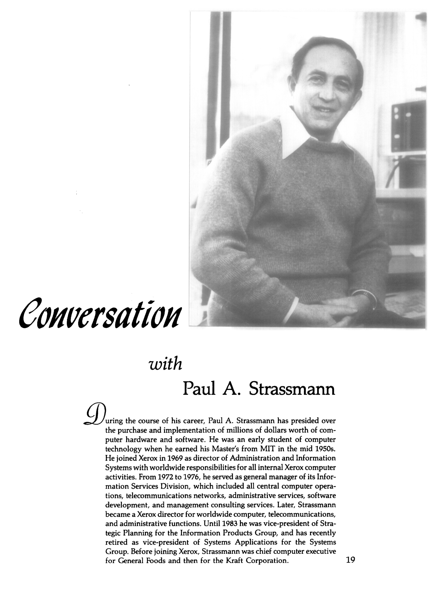

This interview was conducted by Shoshana Zuboff. In it, Strassmann and
Zuboff discuss a range of issues, including the historical
significance of the “computer revolution,” the changing division of
labor, emerging sources of competitive advantage, and the problems
confronted by traditional hierarchical organizations as they attempt
to apply information technology in an increasingly competitive
marketplace.

Citation: [https://doi.org/10.1016/0090-2616(85)90034-8](https://doi.org/10.1016/0090-2616(85)90034-8)

*Conversation with Paul A. Strassmann*, Organizational Dynamics, Volume 14, Issue 2, 1985, Pages 19-34,ISSN 0090-2616

[Science Direct](https://www.sciencedirect.com/science/article/pii/0090261685900348) (3 MB pdf).

