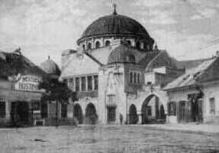
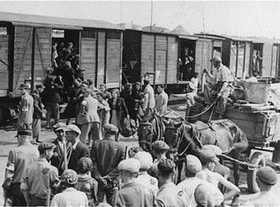
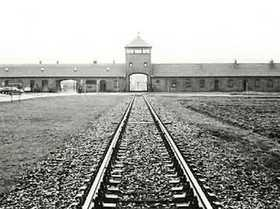
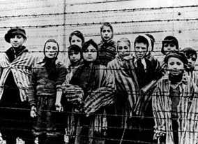
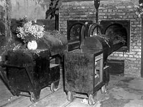
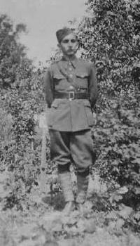
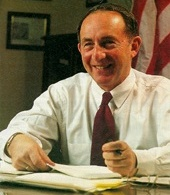

# Paul A. Strassmann - pätnásťročný partizán - info

#### MEDZINÁRODNÁ VEDECKÁ ODBORNÁ KONFERENCIA O HOLOKAUSTE V TREČÍNE

## Paul A. Strassmann - pätnásťročný partizán

Na trenčianskej celoslovenskej konferencii o hrôzach holokaustu v čase druhej svetovej vojny
bol ako čestný hosť aj Paul A. Strassmann z USA. Narodil sa v Trenčíne v rodine židovského
podnikateľa (v meste vlastnil veľkoobchod a na jeho okraji tehelňu). Počas vojny zahynulo v
koncentračných táboroch 19 príslušníkov široko rozvetvenej rodiny. Zachránil sa len Paul a jeho
o pár rokov staršia sestra, pracovne nasadená v zbrojovke. Paul sa dostal začiatkom septembra
1944 v okolí Trenčína ako 15-ročný k partizánom. Stal sa príslušníkom skupiny Stalin – Jegorov.

Po viac ako polročnej odbojovej činnosti spoločne s partizánskou skupinou sa po mnohodňovom
náročnom prechode horským terénnom až v marci 1945 spojili s postupujúcimi jednotkami Sovietskej
armády. Paul sa postupne dostal do regrutačného strediska čs. armády v Poprade. Po krátkom zotavení
vo Vysokých Tatrách bol začlenený do armády. Hneď v máji 1945, keďže dobre ovládal nemčinu, bol
vyslaný spoločne s ďalšími vojakmi na zabezpečenie územia bývalých Sudiet. Jeho vojenská anabáza
sa skončila v Bratislave v hodnosti desiatnika. Po vojne začal študovať angličtinu na pražskej
Karlovej univerzite. Náhoda i skutočnosť, že bol bývalým partizánom, mu pomohli a výrazne zmenili
jeho život. ( Foto sa po kliknutí zväčší.)

„Začiatkom roka 1948 som sa v Trenčíne stretol s vtedajším šéfom okresného výboru komunistickej
strany. Povedal mi: Pavol, prichádzajú nové časy, ale pre takých, ako si ty, z buržoáznej rodiny,
nebudú až také dobré. Si partizán a preto ti dobre radím: Radšej choď preč! Pochopil som, že
nežartuje, a tak som sa 8. februára 1948 ešte stihol dostať do Veľkej Británie a odtiaľ po pár
mesiacoch do USA,“ spomína na svoju anabázu Paul Strassmann.

## Vybral si počítače

V USA sa mu podarilo dostať sa na najprestížnejšiu školu technického smeru v celých Spojených
štátoch, na MIT (Massachusetts Institute of Technology). Venoval sa štúdiu výpočtovej techniky. Ako
jeden z prvých vypracoval dizertačnú prácu na tému: Využitie počítačov. V roku 1955, keď sa v USA
začínala postupne presadzovať výpočtová technika do mnohých oblastí života, bol doslova hlad po 
takýchto odborníkoch. Paul sa postupne vypracoval vo firmách General Foods, Kraft Corporation a Xerox
na vedúceho pracovníka, zodpovedného za informačné technológie.

V roku 1985 odišiel do dôchodku, ale naďalej pracoval ako konzultant pre také firmy ako General
Electric, Citicorps, IBM, General Motors, Texas instrument. V čase, keď sa končila studená vojna a
sovietske impérium sa postupne rozpadalo, bolo jasné, že je zbytočné vynakladať na armádu také veľké
prostriedky. Americký kongres tlačil na ich redukciu. Paul A. Strassmann začal pracovať pre mnohé
vládne orgány vo Washingtone ako poradca :

[viac&nbsp;&gt;&gt;&gt;](http://www.strassmann.com/bio)

## Generálsky post i medaila

V Pentagóne sa stal členom skupiny siedmich ľudí (tzv. sivých hláv alebo rady starších), ktorá
vypracovala návrh, podľa ktorého sa podarilo v rokoch 1989 až 1995 ušetriť z rozpočtu ozbrojených
síl vyše 70 miliárd dolárov. „Dávali sme odporúčania, skonsolidovali sme financie. Bol so riaditeľom
zodpovedným za informačné technológie, konsolidáciu financií, personálny manažment a logistiku. Len
ročný rozpočet spomínaných zložiek bol vyše 10 miliárd dolárov. Vojenský ekvivalent mojej funkcie,
ktorú som vtedy v Pentagóne zastával, bola hodnosť generálporučíka,“ konštatuje Paul Strassmann.

Ako hosťujúci profesor prednášal na mnohých amerických univerzitách, okrem iného aj vo vojenskej
akadémii West Point. Po roku 2002 prešiel na podobnú pozíciu v NASA (Národnom úrade pre astronautiku),
ktorý vtedy prechádzal rozpočtovou krízou. Podarilo sa mu spoločne s kolegami ušetriť 2,2 miliardy
dolárov a za túto prácu získal najvyššie ocenenie, ktoré môže civil dostať. V súčasnosti okrem iného
pôsobí ako konzultant pre americké vojenské námorníctvo.

Jozef Žiak - foto archív PAS

[&lt;&lt;&lt;&nbsp;&nbsp;späť](http://www.klubvtn.info/info_19a.htm)

KVT TN&nbsp;©&nbsp;06.03.2008
Upravené: 04.04.2012

