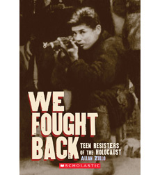

> Paul Strassmann is one of the partisans whose story is told
> in this book,  written for readers in grades 6-8, and available
> from [Scholastic](http://www.scholastic.com/teachers/book/we-fought-back).

# About This Book

When the Nazis invaded their homes and killed their friends and
families, these real-life teens went on the run and joined up with
resisters known as partisans. These brave men and women used guerilla
warfare and sabotage, from blowing up supply trains to attacking
convoys, to thwart the Nazis.

**Fifteen year old Paul** just helped blow up a Nazi supply train. Can he
escape the Germans hunting him for revenge? Fifteen year old Sarah has
lost many loved ones to Nazi murderers. Will partisan fighters accept
her into their secret group? Seventeen year old Frank and his team are
preparing to attack a heavily armed German convoy. Can they succeed
against overwhelming odds--and survive? These and other Jewish young
people took on incredible risks to fight back against the Nazis in
WWII. You will never forget their true stories of courage and
survival.

Based on author interviews with the former partisans, these incredible
stories reveal how ordinary teens can triumph in the face of
overwhelming odds and unimaginable hardships.

# About the Author

**Allan Zullo** is the bestselling author of over 80 books, including The
Sports Hall of Shame series, which has sold over two million copies,
and The Boomers' Guide to Grandparenting. He has been creating and
producing bestselling daily calendars since 1989. He has appeared on
hundreds of radio and television shows, including Good Morning
America, The Today Show and David Letterman. He lives in Fairview,
North Carolina.

* ISBN-10: 0545531799
* ISBN-13: 978-0545531795
* [Amazon](http://www.amazon.com/We-Fought-Back-Resisters-Holocaust/dp/0545531799)
