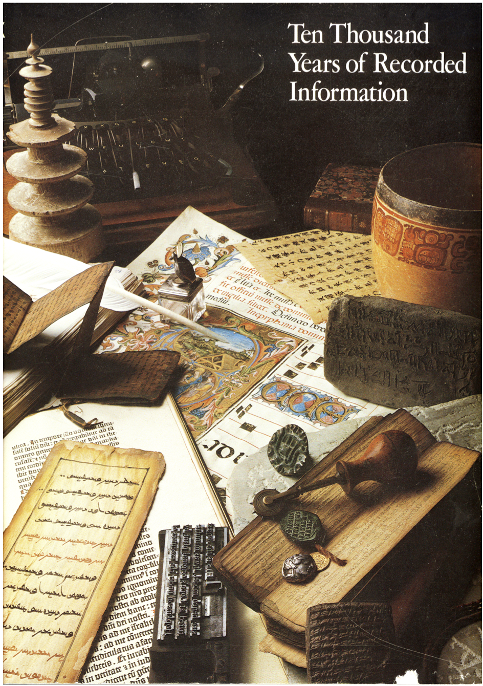

The Xerox exhibit is a collection of rare items, representing the
evolution of human written communication, from ink on prehistoric
caves to engraved plaques on spacecraft heading beyond the solar
system. The exhibit was on display in the lobby of Xerox world
headquarters (Stamford, CT) from 1977-2007.

View the [catalog](http://pubs.strassmann.com/files/xerox-catalog.pdf) (461 MB pdf).

### Foreword

The planning for a newly constructed corporate headquarters of Xerox started in
1976. Management decided to authorize collection of objects that would
represent the evolution of human efforts to communicate in writing. It would
be in this context that we would illustrate the advances in the written message
to Xerox employees and to headquarters visitors.

The Xerox exhibit was assembled entirely by Xerox personnel, led by
Paul A.  Strassmann. A list of desired objects was compiled based on a
book published on the occasion of the 500th anniversary of the
invention of printing, Hendrick D.L. Vervliet’s (editor) “The Book
Through Five Thousand Years” (Phaidon, 1972). A desired list was
circulated to foremost dealers in rare books as well as to the General
Managers of Xerox subsidiaries who would be expected to contribute
objects representing their countries.

Collection of the exhibit started in 1977, with the objective of
placing items in custom-made climate controlled cases in the lobby of
Xerox headquarters.  Objects were acquired from diverse sources
including a few donations. A few gaps in the collection were filled
with loans from museums. These loans have been now returned but are
nevertheless included in this catalogue as facsimile copies to
complete the historical sequence.

On November 1, 2007 Xerox decided to move to a more modest location.
Strassmann was recalled from retirement to oversee the placement of
the entire Xerox collection under terms to be settled by
negotiation. We are offering the collection as a set, not as
individual pieces.

The enclosed catalogue illustrates the entire collection, with text
contributed by Prof. Alvin Eisenman from Yale University.
