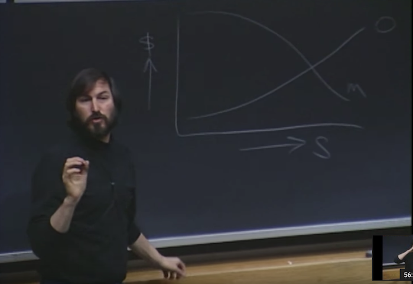

> Steve Jobs, one of the computer industry’s foremost entrepreneurs, gives a wide-ranging talk 
> to a group of MIT Sloan School of Management students in the spring of 1992. (1hr 12min)

   <a href="http://www.youtube.com/watch?feature=player_embedded&v=Gk-9Fd2mEnI&t=218" target="_blank">
      

</a>
   

### Partial transcript from the opening of Steve Jobs' talk:

There's a really interesting book that was written by a guy named
[Paul Strassmann](http://strassmann.com), and Paul has one of the more
interesting jobs on the planet. He's the chief information officer -
CIO - of a very large organization called the Pentagon. And they
really understand software there. I had a conversation with him not
too long ago.

He said the lesson from the Gulf War was that the best software will
win the war. So they're trying to do a lot of work in the software area.

He wrote a book though before he got this job, it's called *[The 
Business Value of Computers.](http://www.infoeconomics.com/business-value.php)*
It's rather thick and it's not good
bedtime reading but you can plow through it and there's some 
incredible stuff in it. He asked two questions in particular:

One was he surveyed a bunch of companies from "not very successful"
to "really successful," and he asked how much they're spending on
information technology as a percentage of revenues. And he got a very
counterintuitive answer. You'd think that either the really successful
companies would either spend *more* or *less* than the not-successful
companies, depending on your theory. But it was exactly the same.

They all spent about 2% of revenues on information technology.
And he found this curious, and so he asked another question: how
do they spend their money?

And he found out that the really successful ones, or actually,
let's start with the not-so-successful ones. He found out that
the not-so-successful ones spent the majority of their money
on management productivity. And the more successful ones spent
the majority of their money on operational productivity. 

Now, this was not very pleasant for me to read because I spent
the first 10 years of my life on management productivity, which
was PCs. PCs and Macs never attacked operational productivity, 
they just attacked management productivity...
