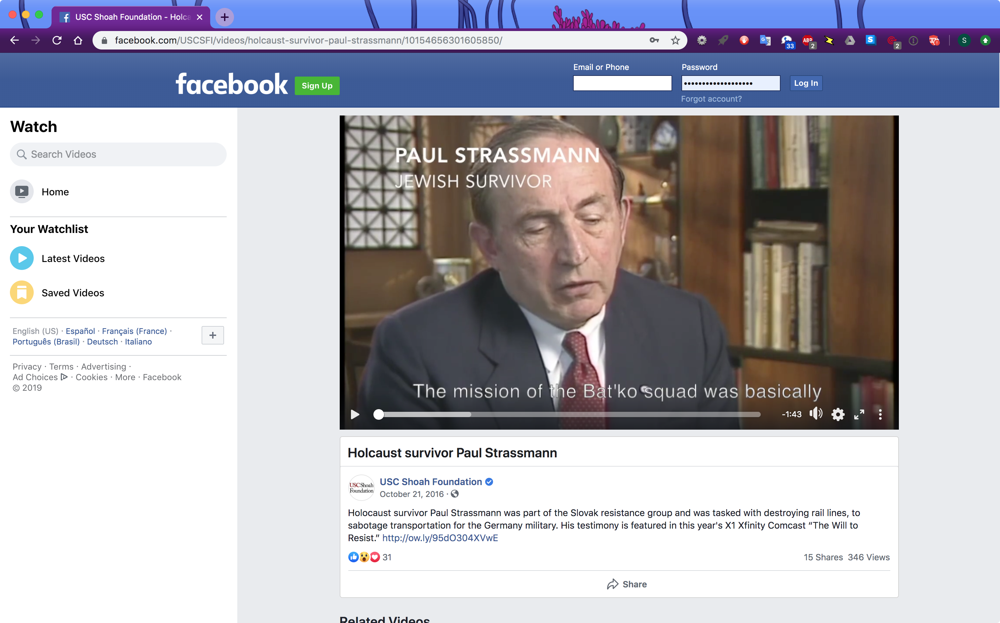

Holocaust survivor Paul Strassmann was part of the Slovak resistance group and was tasked with destroying rail lines, to sabotage transportation for the Germany military. His testimony is featured in this year's X1 Xfinity Comcast “The Will to Resist.”
[http://ow.ly/95dO304XVwE](http://ow.ly/95dO304XVwE)

[video link](https://www.facebook.com/USCSFI/videos/10154656301605850/)

